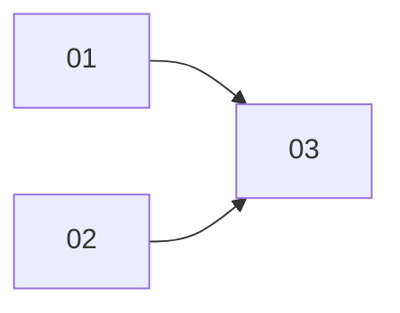

# Cards Jira — [Nombre de la Misión]

**Epic:** [Clave del epic en Jira o "pendiente"]
**Tablero:** [Clave del tablero, ej. SEL]
**Tamaño del equipo:** [Número de personas]

## Contexto de Implementación

**Pack path:** `app/packs/<pack>/`

**Entidades clave:**
- `[Modelo]` — [descripción breve, path dentro del pack]

**Patrones de referencia:**
- `[ClaseExistente]` — [qué patrón implementa y por qué aplica aquí]

**Decisiones de ADR vigentes:**
- [Decisión aceptada que afecta la implementación] — ver `ADR/NN_<slug>.md`

---

## Mapa de Ejecución

> Las cards en el mismo nivel sin flechas entre ellas pueden ejecutarse en paralelo.

---

## 01 — [Título]

**Tipo:** [Tipo de issue de Jira, ej. Historia | Error | Spike. Por defecto Historia si se omite]
**Estimación:** [ej. 2h]
**Depende de:** — *(o lista: T02, T03)*

**Resumen:** [Una línea — qué hay que hacer]

**Archivos a modificar:**
- `path/dentro/del/pack/archivo.rb`

**Patrón de referencia:** `[ClaseExistente]` *(omitir si no aplica)*

**Criterios de Aceptación:**
- [Criterio verificable y concreto]
- [Criterio verificable y concreto]

---

## 02 — [Título]

**Tipo:** [Tipo de issue de Jira, ej. Historia | Error | Spike. Por defecto Historia si se omite]
**Estimación:** [ej. 3h]
**Depende de:** T01

**Resumen:** [Una línea — qué hay que hacer]

**Archivos a modificar:**
- `path/dentro/del/pack/archivo.rb`

**Criterios de Aceptación:**
- [Criterio verificable y concreto]
