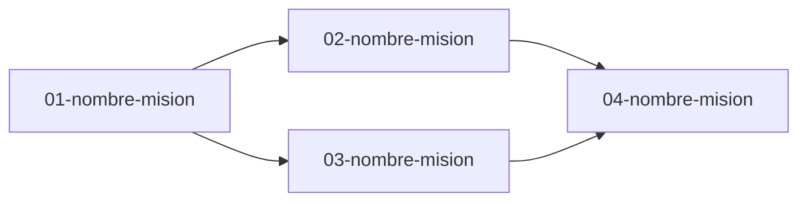

# Track: [Nombre]

**Equipo:** [Nombre del equipo]
**Tablero Jira:** [Clave del tablero, ej. SEL]
**Jira Card:** [Clave de la card de tipo Track, ej. SEL-100]
**Owner:** [Arquitecto del track]
**Reviewer:** [EM]
**Status:** draft | active | closed

## Problema

[Un párrafo. Qué problema de negocio resuelve este track y para quién. Sin detalles de implementación — eso va en Especificación de la Solución.]

## Requisitos No Funcionales

Restricciones de calidad o diseño que aplican a todo el track y superan el estándar técnico general de Buk. Incluir solo las categorías aplicables: Performance, Seguridad, Auditoría, Escalabilidad, Mantenibilidad, Compatibilidad, Privacidad de datos.

| ID | Categoría | Requisito no funcional |
|----|-----------|------------------------|
| RNF-01 | [categoría] | [descripción del requisito] |

## Notas de Investigación

[Hallazgos clave de la exploración del codebase. Qué se descubrió, validó o descartó. Se actualiza conforme evoluciona el track.]

## Entidades de Dominio

| Entidad | Definición |
|---------|-----------|
| [Entidad] | [Qué significa en este contexto, derivada del código existente] |

## Reglas de Negocio

- [Restricción o invariante que todas las misiones de este track deben respetar]

## Especificación de la Solución

### Descripción

[Descripción detallada de la solución técnica propuesta, coherente con los requisitos funcionales y no funcionales declarados.]

### Diagramas

[Diagramas Mermaid de la solución. Usar `erDiagram` para modelo de datos, `graph LR` para flujos y dependencias, `sequenceDiagram` para interacciones entre componentes. Incluir todos los tipos que apliquen.]

### Contratos e Integraciones Externas (opcional)

[Solo para Building Blocks compartidos o contratos con sistemas externos al webapp. Qué se modifica o expone, quién lo consume, implicancias de frecuencia o volumen.]

### Infraestructura (opcional)

[¿Requiere apoyo de SRE o cambios en infraestructura? ¿Ya fueron informados y validaron?]

### Herramientas de Adopción (opcional)

[Solo si el track introduce o modifica componentes core que otros equipos deban adoptar. Clasificar como Skills (requieren comprensión profunda) o Comandos (pasos determinísticos).]

## Alternativas de Solución

Las alternativas consideradas y el análisis de trade-offs están documentados en [`ADR/01_alternativas-solucion.md`](ADR/01_alternativas-solucion.md).

## Riesgos

| Riesgo | Probabilidad | Impacto | Mitigación |
|--------|-------------|---------|------------|
| [descripción del riesgo] | Alta / Media / Baja | Alto / Medio / Bajo | [estrategia de mitigación y costo-beneficio] |

## Instrumentación para Métricas

[Instrumentación técnica necesaria para monitorear las métricas de éxito declaradas en el spec. Qué se mide, cómo y dónde.]

## Mapa de Misiones

## Estrategia de Desarrollo

**Criterio de slicing:** [Indicar cuál y por qué maximiza el valor — por proceso de negocio / segmento de usuario / geografía / canal / complejidad funcional]

| Orden | Misión | Valor que entrega | Lanzamiento |
|-------|--------|-------------------|-------------|
| 1 | [nombre] | [qué valor entrega y para quién] | Pilotos / Todos |
| 2 | [nombre] | [qué valor entrega y para quién] | Pilotos / Todos |

**Rollout técnico:**
- **Feature flags:** [Capacidad de activar/desactivar por tenant, país o tamaño]
- **Rollback:** [Cómo volver atrás sin pérdida de datos ni downtime]
- **Migraciones:** [Si hay cambios de modelo, cómo se migra sin disrupción y con posibilidad de rollback]
- **Limpieza de deuda:** [Si se genera deuda técnica, en qué etapas se elimina]

## Fuera de Alcance (nivel track)

- [Qué NO cubre este track explícitamente]

## Notas de Arquitectura

- [ADRs aceptados y sus implicancias. Decisiones técnicas relevantes y patrones existentes a seguir.]

## Preguntas Abiertas

- [Decisiones no resueltas que afectan múltiples misiones de este track]

## Referencias

- [Link a spec-track.md, Confluence, Figma, o área de código relevante]
