# Manual de trabajo — Sin agentes

Guía para trabajar en este sistema sin usar agentes de IA. La estructura de archivos y el proceso de revisión son idénticos al flujo con agentes — la diferencia es que los documentos los escriben los humanos.

Cada equipo puede elegir su nivel de automatización. Este manual documenta el extremo 100% manual. En cualquier punto se puede incorporar un agente para acelerar la generación de borradores sin alterar el proceso de revisión.

---

## Principio base

**Las specs son la fuente de verdad.** Un PR de código en `buk-webapp` sin spec aprobada no debería mergearse. El flujo de revisión en GitHub hace cumplir este orden: primero se aprueba la spec, luego se implementa.

---

## Estructura de ramas

| Contexto | Convención | Ejemplo |
|----------|-----------|---------|
| Nuevo track (specs) | `spec/<track>` | `spec/2026/0601_onboarding-empresas` |
| Nueva misión (specs) | `spec/<track>/<mission>` | `spec/2026/0601_onboarding-empresas/01_formulario-inicio` |
| ADR de track o misión | `adr/<track>/<slug>` | `adr/2026/0601_onboarding-empresas/validacion-rut` |
| Implementación (buk-webapp) | `feat/<mission>` | `feat/01_formulario-inicio` |

Las ramas de specs se crean en **buk-specs**. Las ramas de implementación se crean en **buk-webapp**.

---

## Flujo de un track

### 1. Crear el track

**Responsable: PM**  
Crear rama `spec/<track>` en buk-specs.

```
teams/<team>/tracks/YYYY/MMDD_<track>/
  spec-track.md     ← PM lo escribe
```

Abrir PR con:
- **Título:** `[spec-track] <nombre del track>`
- **Reviewers:** Stakeholders del área
- **Label:** `spec` `track` `needs-review`

El PR no se mergea hasta que al menos un stakeholder apruebe.

---

**Responsable: Arquitecto del track**  
Sobre la misma rama (o una nueva rama desde ella), agregar:

```
teams/<team>/tracks/YYYY/MMDD_<track>/
  track.md          ← Arquitecto lo escribe
  ADR/
    .gitkeep
```

Abrir PR con:
- **Título:** `[track] <nombre del track>`
- **Reviewers:** EM
- **Label:** `spec` `track` `needs-review`

Antes de escribir `track.md`, explorar el código relevante en `buk-webapp` para derivar entidades de dominio reales y notas de arquitectura. El `track.md` debe referenciar archivos concretos del codebase.

El PR no se mergea hasta que EM apruebe.

---

### 2. Registrar decisiones arquitectónicas (ADRs de track)

**Responsable: Arquitecto del track**  
Cuando surge una decisión que afecta todo el track, crear un ADR antes de definir las misiones.

```
teams/<team>/tracks/YYYY/MMDD_<track>/ADR/
  NN_<slug>.md    ← Arquitecto lo escribe
```

Abrir PR con:
- **Título:** `[adr] <nombre del track> — <decisión>`
- **Reviewers:** EM + al menos un dev del equipo
- **Label:** `adr` `needs-review`

Al aprobar el ADR, actualizar `track.md` (Architecture Notes) en el mismo PR o uno inmediatamente siguiente.

---

### 3. Definir el Mission Map

El Arquitecto actualiza la sección `## Mission Map` en `track.md` con el diagrama Mermaid que muestra qué misiones existen, en qué orden, y cuáles pueden correr en paralelo.

Este diagrama es la referencia autoritativa de dependencias. Toda misión que arranca debe tener sus misiones upstream en estado `done`.

---

## Flujo de una misión

Se repite para cada misión del Mission Map. Las misiones con `Dependencies: none` pueden comenzar en cualquier momento. Las que tienen dependencias esperan a que las upstream estén `done`.

### 4. Crear la misión

**Responsable: PM**  
Crear rama `spec/<track>/<mission>` desde `master`.

```
teams/<team>/tracks/YYYY/MMDD_<track>/NN_<mission>/
  spec-mission.md     ← PM lo escribe
```

Abrir PR con:
- **Título:** `[spec-mission] <nombre de la misión>`
- **Reviewers:** EM + Champion asignado
- **Label:** `spec` `mission` `needs-review`

El PM setea `Dependencies` según el Mission Map del track. El PR no se mergea hasta que EM apruebe.

---

**Responsable: Champion**  
Sobre la misma rama, agregar:

```
teams/<team>/tracks/YYYY/MMDD_<track>/NN_<mission>/
  1_mission.md        ← Champion lo escribe
  2_jira-cards.md     ← Champion lo escribe
  ADR/
    .gitkeep
```

Abrir PR con:
- **Título:** `[mission] <nombre de la misión>`
- **Reviewers:** EM + Arquitecto del track
- **Label:** `spec` `mission` `needs-review`

El `1_mission.md` debe tener al menos un escenario Given/When/Then por historia, con `Dependencies` consistente con `spec-mission.md`. El `2_jira-cards.md` debe incluir el Execution Map Mermaid.

El PR no se mergea hasta que EM **y** Arquitecto aprueben. Al mergear, el Champion crea las tarjetas en Jira y actualiza el `Status` a `ready`.

---

### 5. Registrar decisiones arquitectónicas (ADRs de misión)

**Responsable: Champion**  
Cuando durante la definición o implementación surge una decisión técnica específica a esta misión:

```
teams/<team>/tracks/YYYY/MMDD_<track>/NN_<mission>/ADR/
  YYYYMMDD_<slug>.md    ← Champion lo escribe
```

Abrir PR con:
- **Título:** `[adr] <nombre de la misión> — <decisión>`
- **Reviewers:** EM + Arquitecto del track
- **Label:** `adr` `needs-review`

Al aprobar, actualizar `1_mission.md` (Architecture Notes o Context) en el mismo PR.

---

### 6. Implementación en buk-webapp

**Responsable: Champion (o dev asignado)**  
Crear rama `feat/<mission>` en **buk-webapp** desde `main`.

Antes de escribir código, leer en orden:
1. `specs/teams/<team>/context.md`
2. `specs/teams/<team>/tracks/<track>/spec-track.md`
3. `specs/teams/<team>/tracks/<track>/track.md`
4. ADRs en `specs/teams/<team>/tracks/<track>/ADR/`
5. `3_summary.md` de misiones listadas en `Dependencies` (solo esas)
6. `specs/teams/<team>/tracks/<track>/<mission>/spec-mission.md`
7. `specs/teams/<team>/tracks/<track>/<mission>/1_mission.md`
8. ADRs en `specs/teams/<team>/tracks/<track>/<mission>/ADR/`

Implementar historia por historia, comenzando por P1. Cada historia debe cumplir todos sus Given/When/Then antes de pasar a la siguiente.

Abrir PR en buk-webapp con:
- **Título:** `feat: <objetivo de la misión en una línea>`
- **Descripción:** incluir enlace a `1_mission.md` y listar los escenarios de aceptación cubiertos
- **Reviewers:** al menos un dev del equipo + EM
- **Label:** `feat` + label del equipo

El PR no se mergea hasta que todos los Given/When/Then estén verificados por el reviewer.

---

### 7. Actualizar el summary y cerrar la misión

**Responsable: Champion**  
Al mergear el PR de implementación, crear o actualizar `3_summary.md` en buk-specs:

```
teams/<team>/tracks/YYYY/MMDD_<track>/NN_<mission>/
  3_summary.md        ← Champion lo actualiza
```

Abrir PR con:
- **Título:** `[summary] <nombre de la misión>`
- **Reviewers:** EM
- **Label:** `summary` `mission`

Al mergear, actualizar `Status: done` en `1_mission.md` y `spec-mission.md`.

---

### 8. Cerrar el track

**Responsable: Arquitecto del track**  
Cuando todas las misiones están `done`, crear `track-summary.md`:

```
teams/<team>/tracks/YYYY/MMDD_<track>/
  track-summary.md    ← Arquitecto lo escribe
```

Abrir PR con:
- **Título:** `[track-summary] <nombre del track>`
- **Reviewers:** EM
- **Label:** `summary` `track`

Actualizar `Status: closed` en `track.md` al mergear.

---

## Labels recomendados en GitHub

| Label | Color | Uso |
|-------|-------|-----|
| `spec` | azul | Cualquier PR que toca archivos de spec |
| `track` | violeta | PR de `spec-track.md` o `track.md` |
| `mission` | verde | PR de `spec-mission.md` o `1_mission.md` |
| `adr` | naranja | PR que contiene un ADR |
| `summary` | gris | PR de `3_summary.md` o `track-summary.md` |
| `needs-review` | rojo | Bloqueado esperando aprobación |
| `approved` | verde oscuro | Aprobado, listo para merge |

---

## Resumen del proceso de revisión

```mermaid
flowchart LR
    subgraph TRACK["Track"]
        ST[spec-track.md] -->|PR → Stakeholders| TK[track.md]
        TK -->|PR → EM| ADR_T[ADR de track]
        ADR_T -->|PR → EM + dev| MM[Mission Map]
    end

    subgraph MISSION["Misión (por cada una)"]
        MM --> SM[spec-mission.md]
        SM -->|PR → EM + Champion| MIS[1_mission.md + 2_jira-cards.md]
        MIS -->|PR → EM + Arquitecto| JIRA[Cards en Jira]
        JIRA -->|Status: ready| IMPL[Implementación en buk-webapp]
        IMPL -->|PR → EM + dev| SUM[3_summary.md]
        SUM -->|PR → EM| DONE[Status: done]
    end

    DONE -->|todas done| TS[track-summary.md]
    TS -->|PR → EM| CLOSED[Track cerrado]
```



---

## Agentes disponibles como apoyo

Incluso en modo manual, los agentes pueden invocarse puntualmente para acelerar tareas específicas sin cambiar el proceso de revisión en GitHub. Todos corren desde **buk-webapp**.

### Agentes de flujo — reemplazan trabajo de redacción

| Agente | Qué genera | Cuándo llamarlo |
|--------|-----------|-----------------|
| `investigacion` | `spec-track.md` + `track.md` borradores | Al iniciar un nuevo track, antes de abrir los PRs de definición |
| `armado` | `spec-mission.md` + `1_mission.md` + `2_jira-cards.md` | Al definir una nueva misión, antes de abrir los PRs de misión |
| `ejecutor` | Código en buk-webapp + draft PR | Cuando la misión está en `ready` y se quiere delegar la implementación |
| `orquestador` | Prompt listo para el siguiente agente | Cuando no es obvio qué paso sigue en el track |

El flujo de revisión en GitHub no cambia: los archivos generados se revisan y aprueban igual que si los hubiera escrito un humano.

### Agentes a demanda — apoyo técnico en cualquier momento

| Agente | Modos | Cuándo llamarlo |
|--------|-------|-----------------|
| `arquitecto` | Análisis de ADRs · Búsqueda técnica · Generación de ADR | Antes de escribir `track.md` o `1_mission.md`, o cuando surge una decisión técnica que necesita documentarse |
| `cloud-architect` | Impacto de cambio · Diseño · Revisión IaC · ADR cloud · Análisis de infra | Antes de ejecutar cambios de infraestructura significativos, o al revisar PRs de Terraform / CloudFormation |

Estos agentes **no generan código ni modifican archivos sin aprobación explícita**. Producen análisis, diseños y borradores que el humano revisa antes de actuar.

---

## Niveles de automatización

El proceso de revisión en GitHub es el mismo independientemente del nivel de automatización elegido.

| Nivel | Qué hace el humano | Qué hacen los agentes |
|-------|-------------------|-----------------------|
| **100% manual** | Escribe todos los docs, abre todos los PRs | Nada |
| **Apoyo técnico** | Todo lo anterior + consulta `arquitecto` o `cloud-architect` ante decisiones puntuales | Análisis, búsqueda de definiciones, borradores de ADR |
| **Borradores con agente** | Revisa, edita y aprueba; abre PRs | `investigacion` y `armado` generan borradores de specs |
| **Ejecución con agente** | Escribe specs, abre PRs, revisa PRs de código | `ejecutor` implementa en buk-webapp desde la misión en `ready` |
| **Full SDD** | Revisa y aprueba en cada checkpoint | Todos los agentes activos según la fase |

En todos los casos: **el merge requiere aprobación humana**. Los agentes generan borradores o implementan, pero no mergean.
