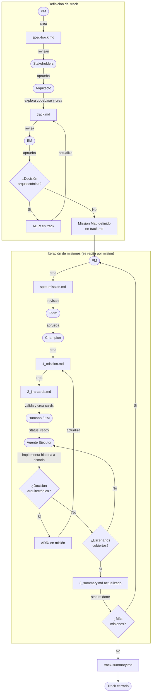

# Spec-Driven Development (SDD)

Documentación técnica del sistema SDD en el stack de Buk. Describe quiénes participan, cómo se estructuran los archivos, y el flujo completo desde la definición de negocio hasta el cierre de una misión.

---

## Qué es el SDD

SDD es el proceso por el cual los equipos de Buk convierten un problema de negocio en código, usando specs como fuente de verdad compartida entre producto, arquitectura y desarrollo. Las specs viven en este repo (`sdd-buk-docs`) y son leídas directamente por agentes de IA que corren en `buk-webapp` o en algún otro proyecto de Buk.

La separación clave es: **el documento de negocio no contiene detalles técnicos, y el documento técnico no repite contexto de negocio**. Ambos existen en paralelo y se referencian mutuamente.

---

## Roles

| Rol | Responsabilidad en el SDD | Owner |
|-----|--------------------------|-------|
| **PM** | Define el problema de negocio y el objetivo de cada misión. | Owner de `spec-track.md` y `spec-mission.md`. |
| **Arquitecto del track** | Traduce el problema a contexto técnico. | Owner de `track.md` y los ADRs de track. Reviewer de `1_mission.md`. |
| **Champion** | Responsable técnico de una misión. | Owner de `1_mission.md`, `2_jira-cards.md`, `3_summary.md` y los ADRs de misión. |
| **EM** | Reviewer de `track.md`, `1_mission.md` y `3_summary.md`. | Aprueba antes de que una misión pase a `ready`. |
| **Stakeholders** | Reviewers de `spec-track.md`. Validan que el problema y los goals reflejen la realidad del negocio. | Sin dueño |
| **Agente ejecutor** | Claude corriendo en `buk-webapp`. Lee el contexto de la misión e implementa el código. No toma decisiones de negocio. | Sin dueño |
| **Agente arquitecto** | Claude con rol de arquitecto técnico. Analiza ADRs, busca definiciones en el codebase, y genera borradores de ADR. Se invoca a demanda, no está atado a una fase específica del flujo. | Sin dueño |
| **Agente cloud architect** | Claude con rol de arquitecto cloud (AWS-first). Evalúa impacto de cambios de infraestructura, diseña arquitecturas, revisa IaC, y genera ADRs cloud. Se invoca a demanda ante cambios de infraestructura significativos. | Sin dueño |

---

## Estructura de archivos

```
teams/
  <team>/
    context.md                        # Metadata del equipo: board Jira, pack de buk-webapp
    tracks/
      YYYY/  # Organización de tracks por estrategia anual
        MMDD_<track>/
          spec-track.md                 # Doc de negocio del track  — Owner: PM
          track.md                      # Doc técnico del track     — Owner: Arquitecto
          ADR/                          # Decisiones arquitectónicas del track
            NN_<slug>.md                # Cualquier definición técnica que se requiera con NN = número secuencial desde 01
          NN_<mission>/              # NN = número secuencial dentro del track (01, 02, …)
            spec-mission.md             # Doc de negocio de la misión — Owner: PM
            1_mission.md                # Doc técnico de la misión    — Owner: Champion
            2_jira-cards.md             # Propuesta de tarjetas Jira
            3_summary.md                # Resumen vivo de la misión (contexto para agentes que requieran leer la misión)
            ADR/                        # Decisiones arquitectónicas de la misión
              00_alternativas_de_solucion.md # Por defecto siempre debe considerar un ADR para ver las distintas alternativas de solución (alto nivel)
              NN_<slug>.md                # Cualquier definición técnica que se requiera con NN = número secuencial desde 01
          track-summary.md              # Creado al cerrar el track
```

### Tipos de archivo

| Archivo | Owner | Reviewer | Propósito |
|---------|-------|----------|-----------|
| `spec-track.md` | PM | Stakeholders | Problema de negocio, goals, métricas de éxito del track |
| `track.md` | Arquitecto | EM | Contexto técnico, entidades de dominio, reglas de negocio, mapa de misiones |
| `spec-mission.md` | PM | Team | Objetivo de negocio, user stories, criterios de aceptación en lenguaje de producto |
| `1_mission.md` | Champion | EM + Arquitecto | Escenarios Given/When/Then, scope técnico, dependencias |
| `2_jira-cards.md` | Champion | EM | Tarjetas Jira con estimaciones y mapa de ejecución paralelo |
| `3_summary.md` | Champion | EM | Documento vivo: qué se construyó, decisiones tomadas, cambios al scope |
| `ADR/<slug>.md` | Champion / Arquitecto | EM / Team / Arquitecto | Decisión técnica puntual con contexto, alternativas y consecuencias |
| `track-summary.md` | Arquitecto | EM | Consolidado del track completo al cierre |
| `context.md` | EM / Arquitecto | — | Identidad del equipo: board Jira, pack en buk-webapp |

### Niveles de ADR

Los ADRs existen en cuatro niveles. Antes de crear uno, elegir el nivel más bajo que aplique:

| Nivel | Ubicación | Alcance |
|-------|-----------|---------|
| Global | `decisions/` | Afecta todos los equipos |
| Equipo | `teams/<team>/decisions/` | Afecta solo ese equipo |
| Track | `teams/<team>/tracks/YYYY/<track>/ADR/` | Afecta todas las misiones del track |
| Misión | `teams/<team>/tracks/YYYY/<track>/<mission>/ADR/` | Específico a una misión |

Un ADR finalizado (`status: accepted`) debe reflejarse en el `track.md` o `1_mission.md` correspondiente.

---

## Flujo de un track



---

## Flujo detallado por fase

### Fase 1 — Definición del track

**Quién inicia:** PM  
**Cuándo:** Cuando hay un problema de negocio que justifica múltiples misiones relacionadas.

1. PM crea `spec-track.md`: define el problema, los goals, el impacto en usuarios y las métricas de éxito.
2. Stakeholders revisan y aprueban `spec-track.md`.
3. Arquitecto lee `spec-track.md`, explora el codebase en `buk-webapp`, y crea `track.md` con: entidades de dominio derivadas del código, reglas de negocio, notas de arquitectura y el Mission Map.
4. EM revisa `track.md`.
5. A medida que surgen decisiones técnicas, el Arquitecto crea ADRs en `ADR/` y actualiza `track.md`.
6. El Mission Map en `track.md` queda definido con el grafo Mermaid de dependencias entre misiones.

**Agentes de apoyo:**

- `investigacion` — genera `spec-track.md` + `track.md` borradores explorando el codebase.
- `arquitecto` (Modo 2) — busca definiciones técnicas en el codebase antes de escribir `track.md`.
- `arquitecto` (Modo 1) — si el track tiene ADRs previos, analiza su consistencia antes de definir misiones.
- `cloud-architect` (Modo 2 o 5) — si el track involucra cambios de infraestructura cloud.

---

### Fase 2 — Definición de misión

**Quién inicia:** PM  
**Cuándo:** Cuando una misión del Mission Map está lista para comenzar (sus dependencias están `done`).

1. PM crea `spec-mission.md`: define el objetivo, las user stories en lenguaje de producto, y los criterios de aceptación a nivel negocio. Incluye el campo `Dependencies`.
2. Team revisa `spec-mission.md`.
3. Champion lee `spec-track.md`, `track.md`, los ADRs del track, los `3_summary.md` de las misiones upstream, y crea `1_mission.md` con escenarios Given/When/Then. El campo `Dependencies` debe coincidir con el de `spec-mission.md`.
4. Champion crea `2_jira-cards.md` con el Execution Map Mermaid y estimaciones.
5. EM valida y crea las tarjetas en Jira. La misión pasa a `ready`.

**Agentes de apoyo:**

- `armado` — genera `spec-mission.md` + `1_mission.md` + `2_jira-cards.md` borradores.
- `arquitecto` (Modo 3) — si la misión requiere documentar una decisión técnica antes de arrancar.
- `cloud-architect` (Modo 5) — si la misión implica cambios de infraestructura, evalúa el impacto antes de crear las cards.

---

### Fase 3 — Ejecución

**Quién ejecuta:** Agente Ejecutor (Claude en `buk-webapp`)  
**Cuándo:** La misión está en `ready`.

1. El agente lee el contexto en orden: `context.md` → `spec-track.md` → `track.md` → ADRs del track → `spec-mission.md` → `1_mission.md` → (solo si tiene dependencias) `3_summary.md` de misiones upstream → ADRs de la misión.
2. Resume los escenarios de aceptación y confirma con el humano antes de escribir código.
3. Implementa historia por historia, comenzando por P1. Cada historia debe cumplir todos sus Given/When/Then antes de avanzar.
4. Si surge una decisión arquitectónica, crea un ADR en `ADR/` de la misión y actualiza `1_mission.md`.
5. Al terminar, actualiza `3_summary.md` y abre un draft PR.

**Modelo:** Sonnet para misiones normales. Opus para decisiones de arquitectura o refactors grandes.

---

### Fase 4 — Cierre

**Misión:** El Champion actualiza `Status: done` en `1_mission.md` y `spec-mission.md`. El `3_summary.md` queda como contexto comprimido para misiones futuras.

**Track:** Cuando todas las misiones están `done`, el Arquitecto crea `track-summary.md` consolidando aprendizajes, decisiones clave y patrones establecidos. Sirve como contexto comprimido para tracks relacionados futuros.

---

## Regla de dependencias

El campo `Dependencies` en `1_mission.md` y `spec-mission.md` controla qué contexto cargan los agentes:

- `Dependencies: none` → el agente no carga ningún summary previo.
- `Dependencies: 01_mission-a, 02_mission-b` → el agente carga solo los `3_summary.md` de esas misiones, en orden de dependencia.

Este campo debe ser consistente con las flechas del Mission Map Mermaid en `track.md`. Si se agrega una flecha en el mapa, hay que actualizar `Dependencies` en la misión afectada.

---

## Agentes

Todos los agentes corren desde `buk-webapp` con las specs accesibles via symlink en `specs/`. Los prompts completos están en `agents/`.

Los agentes se dividen en dos grupos: **de flujo** (atados a una fase del proceso) y **a demanda** (se invocan cuando surge la necesidad, sin importar la fase).

### Agentes de flujo

| Agente | Archivo | Modelo | Cuándo usarlo |
|--------|---------|--------|--------------|
| `investigacion` | `agents/investigacion.md` | Sonnet | Nuevo track — genera `spec-track.md` + `track.md` explorando el codebase |
| `armado` | `agents/armado.md` | Sonnet | Nueva misión — genera `spec-mission.md` + `1_mission.md` + `2_jira-cards.md` |
| `ejecutor` | `agents/ejecutor.md` | Sonnet / Opus | Misión en `ready` — implementa historia a historia en buk-webapp, abre PR |
| `orquestador` | `agents/orquestador.md` | Haiku | No sé qué hacer ahora — lee el estado del track y genera el prompt del siguiente agente |

**`orquestador`** es el punto de entrada cuando no es obvio qué paso sigue. Lee los `Status` de todas las misiones del track y decide qué agente invocar con qué contexto exacto.

### Agentes a demanda

Se invocan en cualquier punto del flujo, ante una necesidad técnica específica. No tienen una fase asignada.

| Agente | Archivo | Modelo | Modos disponibles |
|--------|---------|--------|------------------|
| `arquitecto` | `agents/arquitecto.md` | Opus | 1 — Análisis de ADRs · 2 — Búsqueda de definición técnica · 3 — Generación de ADR |
| `cloud-architect` | `agents/cloud-architect.md` | Opus | 1 — Análisis de infra · 2 — Diseño de arquitectura · 3 — Generación de ADR cloud · 4 — Revisión de IaC · 5 — Impacto de cambio |

**`arquitecto`** — cuándo invocarlo:

- Antes de escribir `track.md`: explorar cómo está implementado un concepto en el codebase (Modo 2)
- Cuando hay decisiones técnicas no documentadas: generar el ADR correspondiente (Modo 3)
- Cuando hay múltiples ADRs y se sospecha inconsistencia: auditar el stack de decisiones (Modo 1)

**`cloud-architect`** — cuándo invocarlo:

- Antes de ejecutar un cambio de infraestructura significativo: evaluar blast radius y rollback (Modo 5)
- Al diseñar la infra para un nuevo track: propuesta AWS-first con diagrama y costo estimado (Modo 2)
- Ante un PR de Terraform / CloudFormation: revisar seguridad, fiabilidad y consistencia con ADRs (Modo 4)
- Para documentar una decisión de infraestructura: generar ADR con alternativas y consecuencias de costo/seguridad (Modo 3)

---

## Estados de una misión

```
draft → ready → in-progress → done
```

| Estado | Significado |
|--------|-------------|
| `draft` | Spec en elaboración, no está lista para ejecutar |
| `ready` | `1_mission.md` aprobado por EM, tarjetas Jira creadas, lista para el agente ejecutor |
| `in-progress` | El agente ejecutor está trabajando en ella |
| `done` | Todos los escenarios cubiertos, `3_summary.md` actualizado, PR abierto |

---

## Relación con buk-webapp

`buk-specs` se vincula a `buk-webapp` mediante un symlink gitignoreado. El agente ejecutor accede a las specs desde `specs/` dentro de `buk-webapp`. Para configurar el symlink, correr `./setup.sh` en `buk-specs`.

Ver `decisions/20260513_workspace-agente.md` para el ADR que define por qué los agentes corren desde `buk-webapp` y no desde `buk-specs`.
