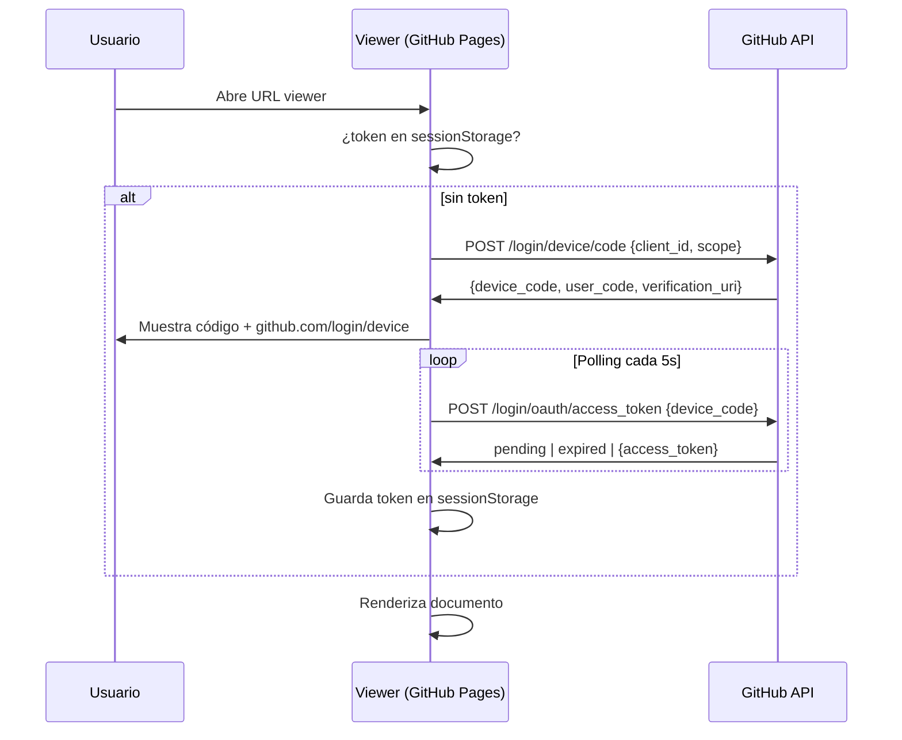
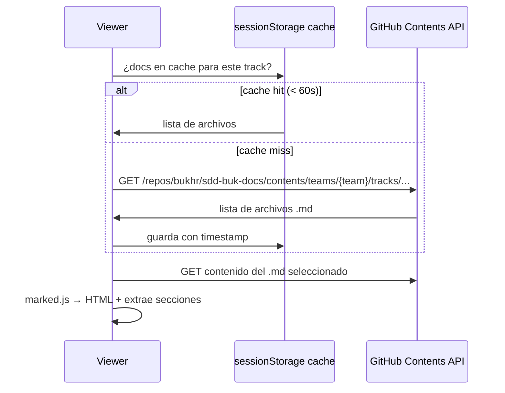
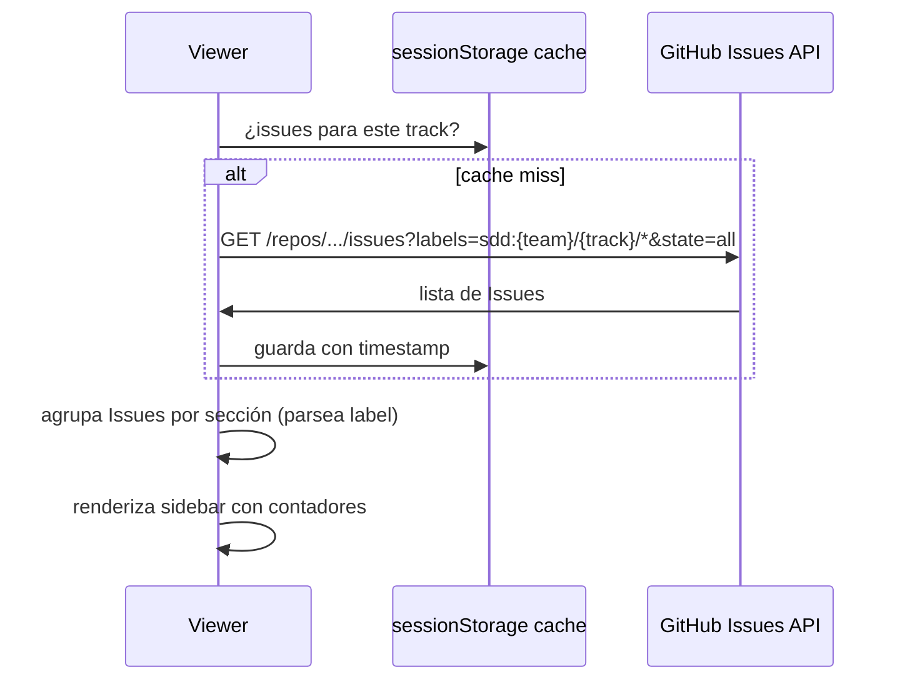

# Misión: SDD Viewer completo

**Track:** SDD Viewer — Vista web de specs
**Epic:** —
**Owner:** JP
**Reviewer:** core-sdd
**Status:** ready
**Dependencias:** none

## Objetivo

Construir el SDD Viewer completo: aplicación web estática en GitHub Pages que permite leer specs del repositorio `sdd-buk-docs` y comentar por sección usando GitHub Issues, autenticándose con GitHub Device Flow (sin servidor).

## Contexto

El repositorio `sdd-buk-docs` es privado — todas las llamadas a la GitHub API requieren autenticación. Se usa **GitHub Device Flow** para el login: el usuario recibe un código de 8 caracteres y la URL `github.com/login/device`, lo ingresa una vez, y queda autenticado. El token resultante se almacena en `sessionStorage` y se usa directamente en todos los `fetch()` a la GitHub API. No hay servidor, no hay proxy, no hay Cloudflare Worker.

El dominio del viewer es `bukhr.github.io/sdd-buk-docs/`. Las URLs usan query params para compatibilidad con GitHub Pages sin configuración extra:

```
/?team=recruiting&track=0101_portal-candidatos
/?team=recruiting&track=0101_portal-candidatos&mission=01
/?team=recruiting&track=0101_portal-candidatos&doc=spec-track&section=problema
```

La app vive íntegramente en la rama `gh-pages` de `sdd-buk-docs`. No modifica `main`.

## Criterios de Aceptación No Funcionales

| ID CA-NF | RNF de origen | Criterio de aceptación no funcional |
|----------|--------------|--------------------------------------|
| CA-NF-01 | RNF-01 (< 2s) | El viewer carga y renderiza el primer documento en menos de 2 segundos medidos con DevTools Network en WiFi estándar |
| CA-NF-02 | RNF-02 (token seguro) | El token OAuth no aparece en ninguna URL, `console.log`, ni atributo HTML del DOM |
| CA-NF-03 | RNF-03 (sin build) | El repositorio en rama `gh-pages` no contiene `package.json`, `node_modules`, ni artefactos de build — solo HTML, JS y CSS planos |

## Especificación Técnica

### Estructura de archivos (rama `gh-pages`)

```
index.html
js/
  auth.js          — GitHub Device Flow: solicitar código, polling, guardar token
  github-api.js    — Wrapper Contents API + Issues API con cache sessionStorage (60s)
  renderer.js      — marked.js CDN + extracción de secciones ## con slugify
  sidebar.js       — Render de hilos, expand/collapse, crear hilo, reply
  router.js        — Leer/escribir query params, navegación entre docs
css/
  styles.css       — Layout 3 columnas, estilos de sección activa, sidebar
```

### Diagramas

**Device Flow (autenticación):**



**Flujo de lectura de documento:**



**Flujo de hilos (sidebar):**



### Slugify de secciones

El slug se genera de forma determinística — cualquier cambio rompe los labels históricos:

```js
function slugify(heading) {
  return heading
    .toLowerCase()
    .normalize('NFD')
    .replace(/[\u0300-\u036f]/g, '') // strip acentos
    .replace(/[^a-z0-9\s-]/g, '')
    .trim()
    .replace(/\s+/g, '-');
}
// "## Métricas de éxito" → "metricas-de-exito"
```

Esta función debe estar en `renderer.js` y ser la única fuente de verdad para slugs en todo el proyecto.

### Label de GitHub Issue

```
sdd:{equipo}/{track-slug}/{section-slug}

Ejemplo:
sdd:recruiting/0101_portal-candidatos/metricas-de-exito
```

El `track-slug` en el label es el nombre del directorio completo (con prefijo `MMDD_`).

## Historias de Usuario

### H1 — Autenticación con GitHub Device Flow

**Como** usuario con cuenta de GitHub,  
**quiero** autenticarme en el viewer con mi cuenta,  
**para** poder leer y comentar specs del repositorio privado.

**Escenarios:**

```gherkin
Escenario: Usuario sin token abre el viewer
  Dado que no hay token en sessionStorage
  Cuando el usuario abre cualquier URL del viewer
  Entonces el viewer muestra una pantalla de login con botón "Conectar con GitHub"
  Y el botón inicia el Device Flow al hacer click

Escenario: Device Flow exitoso
  Dado que el viewer inició el Device Flow
  Cuando el usuario ingresa el código en github.com/login/device y aprueba
  Entonces el viewer detecta la autorización durante el polling
  Y guarda el token en sessionStorage
  Y redirige al documento original que el usuario intentaba ver

Escenario: Device Flow expirado
  Dado que el viewer inició el Device Flow
  Cuando el device_code expira sin que el usuario lo complete
  Entonces el viewer muestra "El código expiró" con botón para reintentar

Escenario: Token presente en sessionStorage
  Dado que hay un token válido en sessionStorage
  Cuando el usuario abre el viewer
  Entonces el viewer carga directamente sin mostrar pantalla de login
```

---

### H2 — Render de documento desde URL

**Como** PM,  
**quiero** abrir una URL y ver el contenido de un spec renderizado como HTML,  
**para** leer los documentos del track sin necesidad de abrir GitHub.

**Escenarios:**

```gherkin
Escenario: URL de track sin doc específico
  Dado que el usuario está autenticado
  Cuando abre /?team=recruiting&track=0101_portal-candidatos
  Entonces el viewer muestra spec-track.md como documento por defecto
  Y el nav lateral lista todos los .md del track en orden de fase

Escenario: URL con doc específico
  Dado que el usuario está autenticado
  Cuando abre /?team=recruiting&track=0101_portal-candidatos&doc=track
  Entonces el viewer renderiza track.md

Escenario: Track inexistente
  Dado que el usuario está autenticado
  Cuando abre una URL con un track que no existe en el repositorio
  Entonces el viewer muestra "Track no encontrado" con link a la raíz
```

---

### H3 — Navegación entre documentos del track

**Como** PM,  
**quiero** navegar entre los documentos del track desde el nav lateral,  
**para** leer el contexto completo sin cambiar la URL manualmente.

**Escenarios:**

```gherkin
Escenario: Nav muestra documentos del track
  Dado que hay un track con spec-track.md y track.md
  Cuando el usuario carga el viewer para ese track
  Entonces el nav lateral muestra ambos documentos en orden de fase
  Y el documento activo está resaltado

Escenario: Click en documento del nav
  Dado que el viewer está mostrando spec-track.md
  Cuando el usuario hace click en "track.md" en el nav
  Entonces el área de contenido renderiza track.md
  Y la URL se actualiza con ?doc=track
```

---

### H4 — Ver hilos por sección en el sidebar

**Como** PM,  
**quiero** ver los hilos de comentarios de cada sección en el sidebar,  
**para** saber qué discusiones están abiertas sin leer todos los Issues en GitHub.

**Escenarios:**

```gherkin
Escenario: Sección con hilos activos
  Dado que hay Issues etiquetados con sdd:recruiting/0101_portal-candidatos/problema
  Cuando el usuario visualiza spec-track.md
  Entonces la sección "## Problema" muestra una barra lateral violeta
  Y un contador inline "2 hilos" junto al título
  Y el sidebar muestra esos 2 hilos agrupados bajo "Problema"

Escenario: Click en sección filtra el sidebar
  Dado que el sidebar muestra hilos de múltiples secciones
  Cuando el usuario hace click en la barra lateral de "## Criterios de Aceptación"
  Entonces el sidebar filtra y muestra solo los hilos de esa sección

Escenario: Expandir un hilo
  Dado que el sidebar muestra un hilo con 3 replies
  Cuando el usuario hace click en el hilo
  Entonces se expanden los 3 replies en orden cronológico
  Y se muestra autor (GitHub login) y timestamp de cada reply
```

---

### H5 — Crear nuevo hilo en una sección

**Como** PM,  
**quiero** crear un hilo de discusión en una sección del documento,  
**para** dejar feedback o abrir una discusión sobre ese punto específico.

**Escenarios:**

```gherkin
Escenario: Crear hilo exitoso
  Dado que el usuario está autenticado y visualiza una sección
  Cuando hace click en "Nuevo hilo" en el sidebar de esa sección
  Y completa el título y el comentario inicial en el modal
  Y hace click en "Crear"
  Entonces se crea un Issue en GitHub con label sdd:{team}/{track}/{section}
  Y el hilo aparece inmediatamente en el sidebar (optimistic update)

Escenario: Validación de campos vacíos
  Dado que el modal de nuevo hilo está abierto
  Cuando el usuario deja el título vacío y hace click en "Crear"
  Entonces el modal muestra "El título es obligatorio" y no crea el Issue
```

---

### H6 — Responder en un hilo existente

**Como** PM,  
**quiero** agregar una respuesta a un hilo existente,  
**para** continuar la discusión sin salir del viewer.

**Escenarios:**

```gherkin
Escenario: Reply exitoso
  Dado que el usuario tiene un hilo expandido en el sidebar
  Cuando escribe un mensaje en el campo de reply y hace click en "Responder"
  Entonces se agrega un comment al Issue de GitHub
  Y el reply aparece inmediatamente al final del hilo

Escenario: Reply en hilo cerrado
  Dado que el usuario ve un hilo con estado "cerrado" (punto gris)
  Cuando intenta escribir un reply
  Entonces el viewer muestra el campo de reply igual (GitHub permite comentar Issues cerrados)
```

---

### H7 — SDD agent genera link al viewer

**Como** champion,  
**quiero** que el output de `/sdd-track` incluya el link al viewer,  
**para** poder compartirlo con el equipo inmediatamente al crear el track.

**Escenarios:**

```gherkin
Escenario: /sdd-track genera link al viewer
  Dado que el SDD agent crea un nuevo track para el equipo "recruiting"
  Cuando termina de crear spec-track.md en la rama correspondiente
  Entonces el output incluye al final:
    "Viewer listo para compartir:
     https://bukhr.github.io/sdd-buk-docs/?team=recruiting&track=<slug>"

Escenario: /sdd-mission genera link al viewer
  Dado que el SDD agent crea una nueva misión
  Cuando termina de crear spec-mission.md
  Entonces el output incluye el link al viewer con ?mission=<N>
```

---

### H8 — Deep link a sección específica (P2)

**Como** PM,  
**quiero** compartir un link que apunte a una sección específica del documento,  
**para** que el receptor llegue directamente al punto relevante.

**Escenarios:**

```gherkin
Escenario: Deep link abre sidebar en sección correcta
  Dado que el usuario abre /?team=T&track=S&doc=spec-track&section=problema
  Cuando el viewer carga
  Entonces el área de contenido hace scroll hasta "## Problema"
  Y el sidebar filtra y muestra los hilos de esa sección automáticamente
```

---

### H9 — Badge de hilos sin respuesta reciente (P2)

**Como** EM,  
**quiero** ver en el nav qué documentos tienen hilos sin respuesta reciente,  
**para** saber dónde hay feedback pendiente de atención.

**Escenarios:**

```gherkin
Escenario: Badge amarillo en documento con hilo inactivo
  Dado que un documento tiene un hilo cuyo último comment tiene más de 48h
  Cuando el usuario carga el viewer
  Entonces el nombre del documento en el nav muestra un badge amarillo con el conteo
```

---

## Fuera de Alcance

- Edición de archivos `.md` desde el viewer.
- Comentarios anónimos o alias libre — todos los usuarios deben autenticarse con GitHub.
- Notificaciones por email o Slack.
- Aprobaciones formales o firma digital.
- Historial de versiones del documento.
- Vista mobile optimizada.
- Servidor propio o proxy para llamadas a la GitHub API.

## Preguntas Abiertas

- **GitHub OAuth App:** ¿Se crea bajo la organización `bukhr` o bajo una cuenta personal? Las OAuth Apps de organización requieren aprobación de un admin de `bukhr`. Resolver antes de T01.
- **Nombre del OAuth App:** Determina el `client_id` que se hardcodea en `auth.js`. Fijar al inicio para no tener que cambiarlo después.
