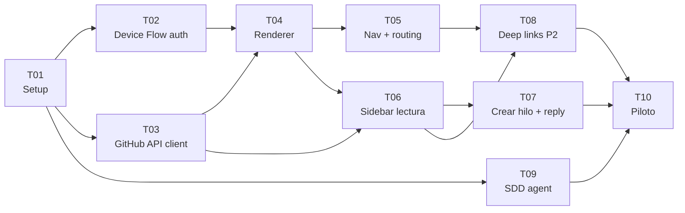

# Cards Jira — SDD Viewer completo

**Epic:** —
**Tablero:** —
**Tamaño del equipo:** 1

## Contexto de Implementación

**Repo:** `bukhr/sdd-buk-docs` (rama `gh-pages`)

**Archivos clave a crear:**
- `index.html` — entry point y layout
- `js/auth.js` — GitHub Device Flow
- `js/github-api.js` — wrapper Contents + Issues API con cache
- `js/renderer.js` — marked.js + slugify + section extraction
- `js/sidebar.js` — hilos, crear thread, reply
- `js/router.js` — query params routing
- `css/styles.css` — layout 3 columnas

**Decisiones de ADR vigentes:**
- GitHub Device Flow para autenticación OAuth (sin servidor ni proxy) — ver `track.md`
- Vanilla JS + marked.js CDN (sin build step) — ver `track.md`
- Query params para routing (compatibilidad con GitHub Pages) — ver `track.md`

---

## Mapa de Ejecución



> T02 y T03 se ejecutan en paralelo después de T01. T05 y T06 en paralelo después de T04. T08 y T09 en paralelo. T10 cierra todo.

---

## T01 — Setup: GitHub Pages + OAuth App

**Tipo:** Spike
**Estimación:** 2h
**Depende de:** —

**Resumen:** Activar GitHub Pages en rama `gh-pages`, crear la OAuth App en `bukhr`, y establecer la estructura de archivos base.

**Archivos a crear:**
- `index.html` (estructura HTML base, imports CDN de marked.js)
- `css/styles.css` (layout 3 columnas vacío)
- `js/auth.js`, `js/github-api.js`, `js/renderer.js`, `js/sidebar.js`, `js/router.js` (stubs vacíos)

**Criterios de Aceptación:**
- `https://bukhr.github.io/sdd-buk-docs/` sirve `index.html` sin errores 404
- La GitHub OAuth App existe en `bukhr` con Device Flow habilitado y el `client_id` anotado
- El `client_id` está hardcodeado en `js/auth.js` (no en `.env`, no en URL)

---

## T02 — Device Flow: autenticación GitHub

**Tipo:** Historia
**Estimación:** 3h
**Depende de:** T01

**Resumen:** Implementar el flujo completo de GitHub Device Flow en `js/auth.js`: solicitar código, mostrar pantalla de login, polling hasta obtener token, guardar en `sessionStorage`.

**Archivos a modificar:**
- `js/auth.js`
- `index.html` (pantalla de login)
- `css/styles.css` (estilos pantalla de login)

**Criterios de Aceptación:**
- Un usuario sin token ve la pantalla de login con botón "Conectar con GitHub"
- Al hacer click, el viewer muestra el código de 8 caracteres y el link `github.com/login/device`
- Después de que el usuario aprueba, el polling detecta el token y lo guarda en `sessionStorage`
- Si el `device_code` expira, el viewer muestra "El código expiró" con botón para reintentar
- El token nunca aparece en ninguna URL ni en el DOM

---

## T03 — GitHub API client con cache

**Tipo:** Historia
**Estimación:** 3h
**Depende de:** T01

**Resumen:** Implementar `js/github-api.js` con métodos para leer archivos via Contents API y leer/crear Issues via Issues API, con cache de 60 segundos en `sessionStorage`.

**Archivos a modificar:**
- `js/github-api.js`

**Criterios de Aceptación:**
- `getFileContent(team, track, filename)` retorna el contenido del `.md` desde la rama correcta
- `listTrackFiles(team, track)` retorna la lista de archivos del track en orden de fase
- `getIssues(team, track)` retorna todos los Issues con label `sdd:{team}/{track}/*`
- `createIssue(team, track, section, title, body)` crea un Issue con el label correcto
- `addComment(issueNumber, body)` agrega un comment al Issue
- Todas las llamadas de lectura usan cache de 60s; las de escritura invalidan el cache del recurso afectado
- Si el token no es válido (401), `github-api.js` llama a `auth.logout()` y recarga la página

---

## T04 — Renderer: marked.js + extracción de secciones

**Tipo:** Historia
**Estimación:** 4h
**Depende de:** T02, T03

**Resumen:** Implementar `js/renderer.js` para renderizar Markdown con `marked.js`, identificar headings `##` como secciones, y agregarles `data-section-slug` y decoración visual (barra lateral).

**Archivos a modificar:**
- `js/renderer.js`
- `css/styles.css` (sección activa con barra violeta, contador de hilos)
- `index.html` (área de contenido)

**Criterios de Aceptación:**
- El contenido del `.md` se renderiza como HTML limpio en el área central
- Cada heading `##` tiene `data-section-slug` con el slug calculado por `slugify()`
- `slugify("## Métricas de éxito")` retorna `"metricas-de-exito"` (acentos removidos, lowercase, guiones)
- Una sección con hilos activos muestra una barra lateral violeta a su izquierda
- El contador de hilos aparece inline junto al título de la sección
- Una sección sin hilos muestra barra lateral gris

---

## T05 — Nav lateral y routing por query params

**Tipo:** Historia
**Estimación:** 3h
**Depende de:** T04

**Resumen:** Implementar `js/router.js` para leer/escribir query params, y el nav lateral con lista de documentos del track, documento activo resaltado, y badge de conteo de hilos por documento.

**Archivos a modificar:**
- `js/router.js`
- `js/sidebar.js` (integración con nav)
- `css/styles.css` (estilos nav)
- `index.html` (nav lateral)

**Criterios de Aceptación:**
- `/?team=T&track=S` carga el viewer y muestra `spec-track.md` como documento por defecto
- `/?team=T&track=S&doc=track` renderiza `track.md`
- El nav lateral lista todos los `.md` del track en orden de fase
- El documento activo está resaltado en el nav
- Hacer click en un documento del nav actualiza `?doc=` y renderiza el nuevo documento
- Un track inexistente muestra "Track no encontrado"

---

## T06 — Sidebar: visualización de hilos

**Tipo:** Historia
**Estimación:** 4h
**Depende de:** T03, T04

**Resumen:** Implementar la parte de lectura de `js/sidebar.js`: agrupar Issues por sección, renderizar hilos en el sidebar con preview, expand/collapse de replies, y filtro al hacer click en una sección.

**Archivos a modificar:**
- `js/sidebar.js`
- `css/styles.css` (estilos sidebar, hilo expandido, hilo cerrado)
- `index.html` (sidebar derecho)

**Criterios de Aceptación:**
- El sidebar muestra todos los hilos del documento activo agrupados por sección
- Cada hilo muestra: título, preview del último comment, iniciales del autor, conteo de replies, estado (punto verde = abierto, punto gris = cerrado)
- Hacer click en un hilo lo expande mostrando todos los replies en orden cronológico con autor y timestamp
- Hacer click en la barra lateral de una sección filtra el sidebar a los hilos de esa sección
- Un hilo sin respuesta desde hace > 48h muestra indicador visual amarillo

---

## T07 — Crear hilo y reply

**Tipo:** Historia
**Estimación:** 3h
**Depende de:** T06

**Resumen:** Implementar en `js/sidebar.js` la creación de Issues y la adición de comments: modal de nuevo hilo, validaciones, optimistic update, y campo de reply en hilos expandidos.

**Archivos a modificar:**
- `js/sidebar.js`
- `css/styles.css` (modal, campo de reply)
- `index.html` (modal de nuevo hilo)

**Criterios de Aceptación:**
- El botón "Nuevo hilo" en cada sección abre un modal con campos de título y comentario inicial
- Si el título está vacío y el usuario hace click en "Crear", muestra error "El título es obligatorio"
- Al confirmar, se crea el Issue en GitHub con el label correcto y el hilo aparece inmediatamente en el sidebar
- El campo de reply está disponible en todos los hilos expandidos (abiertos y cerrados)
- Al enviar un reply, el comment aparece inmediatamente al final del hilo
- El label generado sigue exactamente el formato `sdd:{team}/{track-slug}/{section-slug}`

---

## T08 — Deep links y badges de inactividad (P2)

**Tipo:** Historia
**Estimación:** 3h
**Depende de:** T05, T06

**Resumen:** Implementar deep links a sección específica via `?section=<slug>` y badge amarillo en el nav para documentos con hilos sin respuesta reciente (> 48h).

**Archivos a modificar:**
- `js/router.js`
- `js/sidebar.js`
- `css/styles.css` (badge amarillo)

**Criterios de Aceptación:**
- Una URL con `?section=problema` hace scroll hasta `## Problema` y filtra el sidebar a esa sección al cargar
- El nav muestra un badge amarillo con el conteo de hilos inactivos en los documentos que los tienen
- Un hilo "inactivo" es aquel cuyo último comment o el Issue en sí tiene más de 48h sin actividad

---

## T09 — Integración con SDD agent

**Tipo:** Historia
**Estimación:** 2h
**Depende de:** T01

**Resumen:** Modificar el output de los skills `/sdd-track` y `/sdd-mission` para que incluyan al final el link al viewer generado automáticamente.

**Archivos a modificar:**
- `.claude/skills/sdd-track.md` (o el skill correspondiente en el repo de skills)
- `.claude/skills/sdd-mission.md`

**Criterios de Aceptación:**
- Después de crear un track, el output incluye:
  ```
  Viewer listo para compartir:
  https://bukhr.github.io/sdd-buk-docs/?team={equipo}&track={track-slug}
  ```
- Después de crear una misión, el output incluye el link con `&mission={NN}`
- El link usa el nombre del directorio del track como `track-slug` (con prefijo `MMDD_`)

---

## T10 — Piloto con equipo real

**Tipo:** Spike
**Estimación:** 4h
**Depende de:** T07, T08, T09

**Resumen:** Probar el viewer con un track real con al menos un PM y un stakeholder, recoger feedback, y aplicar ajustes de UX identificados durante el piloto.

**Criterios de Aceptación:**
- Al menos un PM navega el viewer, crea un hilo y deja un reply sin asistencia
- El viewer carga en < 2 segundos medido con DevTools en WiFi estándar
- Los issues creados durante el piloto tienen el label correcto y son visibles en GitHub
- Los ajustes de UX identificados quedan documentados en `3_summary.md` de esta misión
