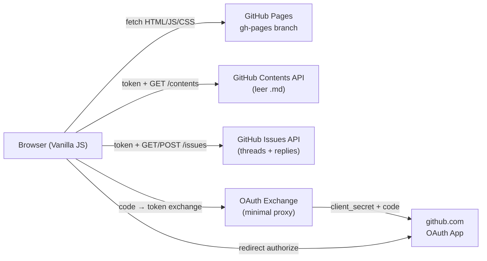
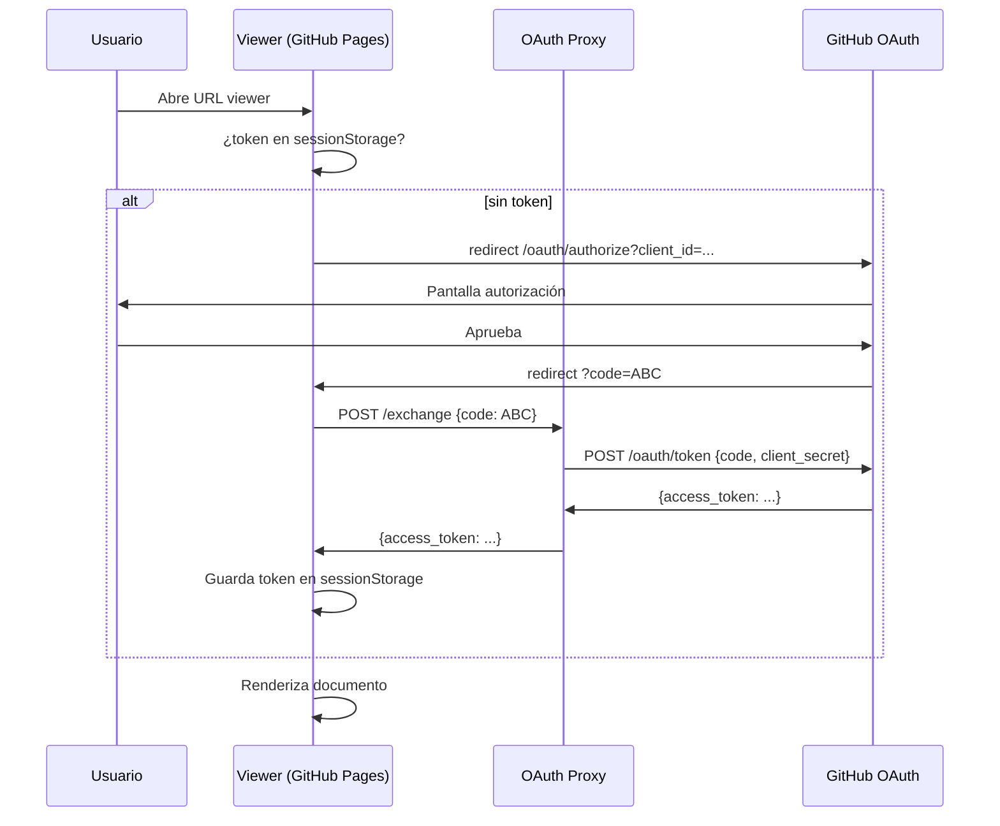
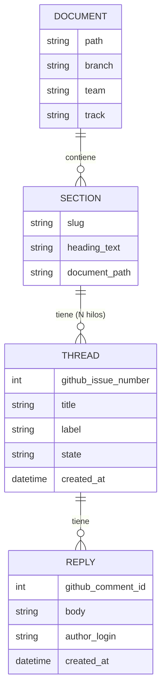
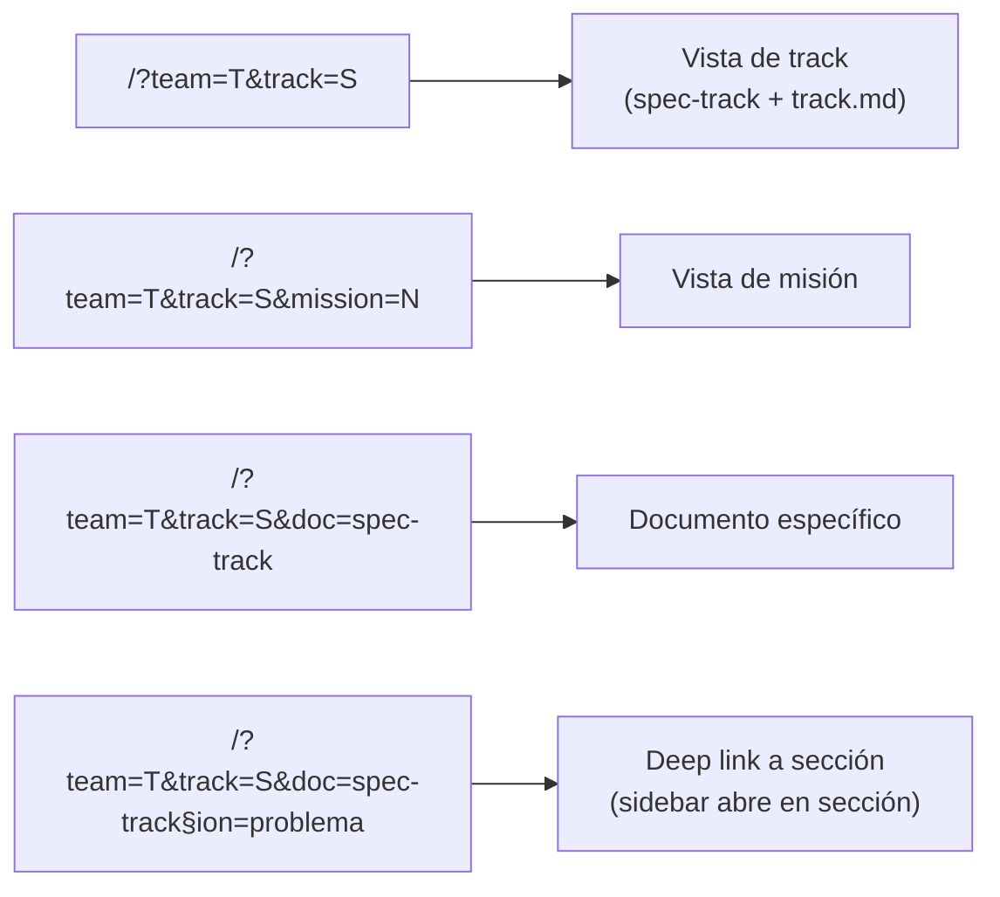
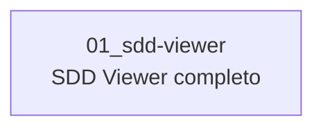

# Track: SDD Viewer — Vista web de specs

**Equipo:** core-sdd  
**Tablero Jira:** —  
**Jira Card:** —  
**Owner:** JP  
**Reviewer:** —  
**Status:** active

## Problema

Los PMs y stakeholders no técnicos no pueden colaborar sobre los specs SDD almacenados en GitHub: el repositorio requiere contexto técnico para navegar, los PR comments llegan cuando el documento ya está avanzado, y compartir un doc para revisión genera fricción. Se necesita una interfaz web que renderice los archivos Markdown directamente desde GitHub y permita comentar por sección sin salir del browser.

## Requisitos No Funcionales

| ID | Categoría | Requisito no funcional |
|----|-----------|------------------------|
| RNF-01 | Performance | El viewer carga en < 2 segundos en conexión normal (WiFi estándar) |
| RNF-02 | Seguridad | El token OAuth del usuario nunca se incluye en URLs ni logs del cliente |
| RNF-03 | Mantenibilidad | Sin build toolchain — Vanilla JS + CDN únicamente; cualquier engineer puede modificar sin setup local |
| RNF-04 | Disponibilidad | Hospedado en GitHub Pages; disponibilidad heredada de GitHub (SLA ~99.9%) |

## Notas de Investigación

Este track construye una aplicación standalone (no parte de buk-webapp). El codebase de referencia es `bukhr/sdd-buk-docs` — el mismo repositorio donde vive esta documentación.

Hallazgos clave:
- El repositorio `sdd-buk-docs` es **privado** → todas las llamadas a la GitHub API requieren autenticación.
- Los usuarios ya tienen cuentas de GitHub → GitHub OAuth es la vía natural de autenticación.
- GitHub OAuth con cliente público (GitHub Pages, sin servidor) requiere un componente mínimo para el intercambio del código de autorización por token (el `client_secret` no puede estar en el frontend). Ver Preguntas Abiertas.
- GitHub Issues API es suficiente como storage de comentarios: sin DB extra, sin infra adicional, en el ecosistema ya conocido por el equipo.
- GitHub Pages soporta SPAs mediante el truco de `404.html` o con routing por query params / hash — esto determina el esquema de URL.

## Entidades de Dominio

| Entidad | Definición |
|---------|-----------|
| `Document` | Archivo `.md` en una rama de `sdd-buk-docs` (Contents API). Identificado por `team/track/filename`. |
| `Section` | Heading `##` dentro de un `Document`. Unidad de comentario. Slug generado por lowercasing + hyphens (ej. `## Métricas de éxito` → `metricas-de-exito`). |
| `Thread` | GitHub Issue scoped a una `Section`. Label: `sdd:<equipo>/<track-slug>/<section-slug>`. Un `Section` puede tener N threads independientes. |
| `Reply` | GitHub Issue Comment dentro de un `Thread`. Autor: identidad GitHub OAuth del usuario. |
| `Track` | Carpeta `teams/<team>/tracks/YYYY/MMDD_<slug>/` — mapea a URL `/?team=<team>&track=<slug>`. |
| `Mission` | Subcarpeta dentro de un track `NN_<slug>/` — mapea a `/?team=<team>&track=<slug>&mission=<NN>`. |

## Reglas de Negocio

- El slug de sección se genera desde el texto del heading `##`: lowercase, espacios → guiones, sin acentos. Debe ser determinístico (mismo texto = mismo slug siempre).
- El label de un Thread sigue el formato exacto `sdd:<equipo>/<track-slug>/<section-slug>` — cualquier Issue sin este formato exacto no se muestra en el viewer.
- Todos los usuarios que lean o comenten deben estar autenticados con GitHub OAuth (repo privado). No hay acceso anónimo.
- Una `Section` se considera "con hilos activos" si tiene al menos un Thread con estado `open`.
- Una `Section` se considera "sin respuesta reciente" si su Thread más reciente tiene su último comment con más de 48 horas de antigüedad.
- El viewer no modifica archivos `.md` — es de solo lectura para el contenido.

## Especificación de la Solución

### Descripción

Aplicación web estática hospedada en GitHub Pages (rama `gh-pages` de `sdd-buk-docs`). El frontend es Vanilla JS + `marked.js` vía CDN, sin build step. Todo el estado vive en la URL (query params) y en la GitHub API.

**Flujo de autenticación:**
El usuario llega al viewer y, si no tiene token, inicia el OAuth flow. El token resultante se almacena en `sessionStorage` y se usa directamente en todos los `fetch()` a la GitHub API. El único componente server-side es el endpoint de intercambio de código OAuth (ver Preguntas Abiertas).

**Flujo de lectura:**
1. La URL indica `team` + `track` (+ opcionalmente `mission` y `doc`).
2. El frontend llama a GitHub Contents API para listar y leer los archivos `.md` de la rama correspondiente.
3. `marked.js` renderiza el Markdown en el área de contenido.
4. El parser identifica headings `##` y genera `data-section-slug` en el DOM.

**Flujo de comentarios:**
1. El frontend llama a GitHub Issues API filtrando por label `sdd:<team>/<track>/*`.
2. Los Issues se agrupan por sección y se renderizan en el sidebar.
3. Crear un Thread = crear un Issue con el label de sección pre-calculado.
4. Crear un Reply = agregar un comment al Issue correspondiente.

### Diagramas

**Arquitectura de componentes:**

**Flujo de autenticación OAuth:**

**Modelo de datos (GitHub Issues como storage):**

**Routing (query params para compatibilidad con GitHub Pages):**

### Infraestructura

Requiere un componente mínimo para el intercambio OAuth (ver Preguntas Abiertas). Si se elige Cloudflare Worker, el deploy es un script JS de ~30 líneas sin estado. No requiere base de datos, no requiere VM, no requiere SRE.

GitHub Pages se activa en Settings del repo — no requiere intervención de SRE.

## Alternativas de Solución

Las alternativas consideradas y el análisis de trade-offs están documentados en [`ADR/01_alternativas-solucion.md`](ADR/01_alternativas-solucion.md).

## Riesgos

| Riesgo | Probabilidad | Impacto | Mitigación |
|--------|-------------|---------|------------|
| GitHub API rate limit (5000 req/h con OAuth token) | Baja con usuarios internos | Medio | Cachear respuestas en `sessionStorage` por 60s; mostrar error amigable si se alcanza el límite |
| OAuth flow complejo para usuarios no técnicos | Media | Alto | Testear con PM y stakeholder real en la Fase 5; iterar UX del login si hay fricción |
| Secciones sin `##` no se identifican como unidades de comentario | Baja | Bajo | Documentar la convención en el template de specs; el viewer muestra el doc completo igual |
| GitHub Pages caído durante una sesión crítica de review | Muy Baja | Alto | Usar GitHub API directamente como fallback (mismo origen del fallo); fuera del control del equipo |
| SDD agent no adopta integración (Fase 5) | Media | Bajo | La app es útil sin la integración; el link se puede generar y compartir manualmente |

## Instrumentación para Métricas

No se requiere instrumentación custom para el MVP. Las métricas de éxito del spec se validan manualmente durante el piloto (Fase 6):

- Tiempo de carga: medir con DevTools Network tab durante prueba piloto.
- Adopción: contar Issues creados vía viewer en el primer mes (GitHub Issues API provee esta data).
- Tasa de error OAuth: revisar logs del OAuth proxy (Cloudflare Worker logs o equivalente).

## Mapa de Misiones

## Estrategia de Desarrollo

**Criterio de slicing:** misión única — el scope es acotado y todas las capas son interdependientes. No hay valor parcial hasta que el viewer lee, muestra hilos y permite comentar.

| Orden | Misión | Valor que entrega |
|-------|--------|-------------------|
| 1 | `01_sdd-viewer` | Viewer completo: auth, render, hilos, comentarios e integración con SDD agent |

**Rollout técnico:**
- **Feature flags:** No aplica — aplicación standalone, no parte de buk-webapp.
- **Rollback:** Revertir el commit en `gh-pages` restaura la versión anterior en < 1 minuto.
- **Migraciones:** Sin base de datos — sin migraciones.
- **Limpieza de deuda:** Si se genera deuda en el MVP (ej. manejo de errores básico), se documenta en el `3_summary.md` de la misión correspondiente para resolverlo en `06_pulido-piloto`.

## Fuera de Alcance (nivel track)

- Edición de archivos `.md` desde el viewer.
- Notificaciones por email o Slack al recibir comentarios.
- Aprobaciones formales o firma digital de docs.
- Historial de versiones del documento en el viewer.
- Vista mobile optimizada.
- Acceso anónimo sin cuenta de GitHub (el repo es privado; requiere OAuth).

## Notas de Arquitectura

- **GitHub OAuth sin proxy completo:** A diferencia de lo planteado en el spec original, no se usa un proxy serverless para los llamados a la API — el frontend usa el token OAuth del usuario directamente. Solo se necesita un endpoint mínimo para el intercambio del código OAuth (ver Preguntas Abiertas).
- **Vanilla JS:** Decisión confirmada. Sin build step, sin dependencias npm. `marked.js` vía CDN (jsDelivr o similar). Esto maximiza la mantenibilidad para un equipo no especializado en frontend.
- **Query params para routing:** Las URLs tipo `/?team=X&track=Y` son compatibles con GitHub Pages sin necesidad del truco `404.html`. Hash routing (`/#/team/track`) es la alternativa si se prefieren URLs más limpias — ambas son válidas para este stack.
- **`sessionStorage` para el token OAuth:** El token no persiste entre sesiones (a diferencia de `localStorage`). Tradeoff: el usuario re-autentica si cierra el tab, pero el riesgo de token robado se reduce.

## Preguntas Abiertas

- **Intercambio OAuth — ¿cómo implementarlo sin exponer `client_secret`?**  
  GitHub OAuth App requiere `client_secret` en el server para el intercambio `code → token`. Opciones:
  1. **Cloudflare Worker** (~30 líneas, gratis en tier free) — solo para este intercambio, no como proxy completo.
  2. **GitHub Device Flow** — no requiere servidor; UX diferente (el usuario copia un código en github.com). Válido para usuarios técnicos.
  3. **GitHub App con instalación en el repo** — más complejo pero más robusto a largo plazo.
  
  Esta decisión bloquea `01_setup-auth`. Resolver antes de iniciar esa misión.

- **Slug de sección y normalización de acentos:** ¿Se usa `normalize('NFD')` + strip diacritics o se mantienen los acentos en el slug? Impacta la compatibilidad de labels históricos si se cambia la función de slugify. Fijar la implementación en `01_setup-auth` y documentarla.

- **Dominio del viewer:** ¿`bukhr.github.io/sdd-buk-docs/`? ¿Custom domain `sdd.buk.internal`? El dominio afecta las URLs que el SDD agent genera. Decidir antes de `05_integracion-agent`.

## Referencias

- [`spec-track.md`](spec-track.md) — spec de negocio aprobado
- [GitHub Contents API](https://docs.github.com/en/rest/repos/contents)
- [GitHub Issues API](https://docs.github.com/en/rest/issues)
- [GitHub OAuth Web Application Flow](https://docs.github.com/en/apps/oauth-apps/building-oauth-apps/authorizing-oauth-apps)
- [marked.js](https://marked.js.org/)
