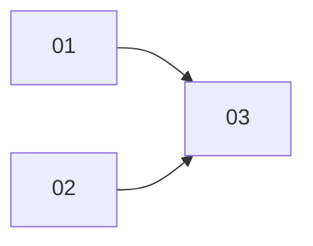

# Cards Jira — Gestión Masiva de Procesos

**Epic:** [Clave del epic en Jira o "pendiente"]
**Tablero:** OB
**Tamaño del equipo:** [Número de personas]

## Mapa de Ejecución

> Las cards en el mismo nivel sin flechas entre ellas pueden ejecutarse en paralelo.

---

## 01 — [Título]

**Tipo:** Task | Bug | Story
**Sugerencia de asignación:** [Rol]
**Estimación:** [ej. 2h]

**Resumen:** [Una línea — qué hay que hacer]

**Criterios de Aceptación:**
- [Criterio verificable]

---

## 02 — [Título]

**Tipo:** Task | Bug | Story
**Sugerencia de asignación:** [Rol]
**Estimación:** [ej. 3h]

**Resumen:** [Una línea — qué hay que hacer]

**Criterios de Aceptación:**
- [Criterio verificable]
