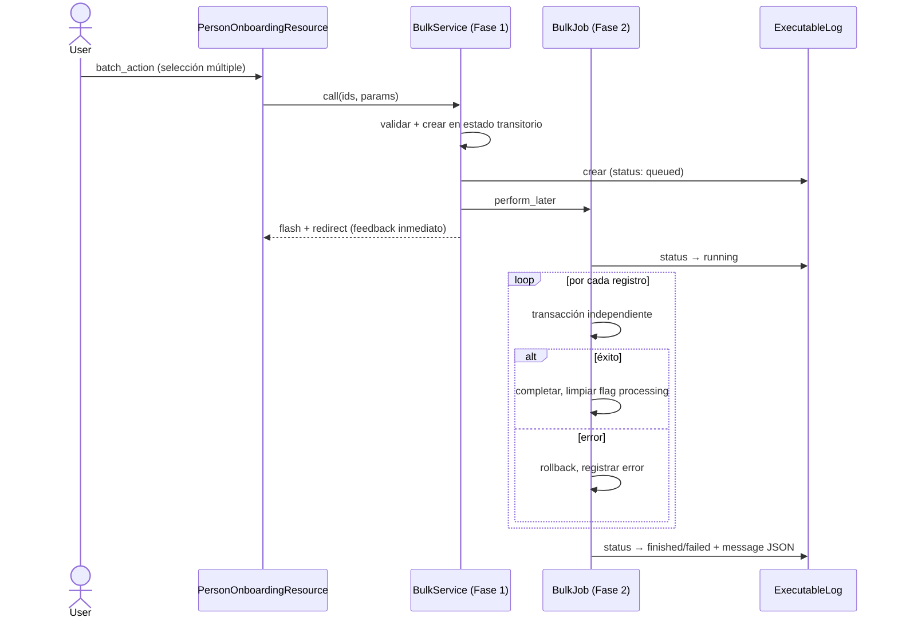
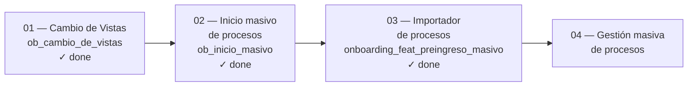

# Track: Acciones Masivas

**Equipo:** Onboarding
**Tablero Jira:** OB
**Jira Card:** OB-88
**Owner:** Martin Jadresic
**Reviewer:** EM + Arquitecto
**Status:** active

## Problema

Los administradores de clientes medianos y grandes (segmento M y L) deben gestionar onboardings en grupos, pero la plataforma solo ofrece operación individual. Iniciar un proceso toma ~1 minuto por persona: para 300 personas, son 5 horas de trabajo manual. El problema se repite en la gestión posterior — modificar, cancelar o eliminar procesos sigue siendo acción por acción — lo que hace inoperable el módulo a escala para el segmento L.

## Requisitos No Funcionales

| ID | Categoría | Requisito |
|----|-----------|-----------|
| RNF-01 | Performance | Toda acción masiva debe ejecutarse de forma asíncrona; soportar ≥ 500 procesos sin degradación significativa |
| RNF-02 | UX | Feedback inmediato al usuario al desencadenar la acción; estado visible (en cola / en progreso / finalizado) durante procesamiento async |
| RNF-03 | Seguridad | Acciones irreversibles (eliminar, cancelar) requieren confirmación explícita del usuario |
| RNF-04 | Auditoría | Toda modificación masiva queda registrada en el historial individual de cada proceso afectado |
| RNF-05 | Concurrencia | Solo una acción masiva puede ejecutarse por vez por tenant; las siguientes se encolan |
| RNF-06 | Consistencia | Error en un proceso individual no afecta al resto de la ejecución masiva (aislamiento por transacción independiente) |

## Notas de Investigación

- El modelo central es `Onboarding::Process`. Su ciclo de vida (creación, resolución de plantillas, creación de tareas, asignaciones, notificaciones) es pesado: no puede ejecutarse síncronamente para lotes grandes sin riesgo de timeout.
- Las vistas previas basaban el resource en `Employee`, lo que excluía personas sin ficha activa. Se migró a `Person` como entidad base en la misión prerequisito CdV.
- Las queries de scopes usan LATERAL JOINs para obtener el proceso más reciente por persona. Se validaron en tenant real (< 1 segundo). Se planificó índice compuesto en `onboarding_processes` para aliviarlas aún más.
- `ExecutableLog` es el mecanismo existente en buk-webapp para tracking persistente de jobs asíncronos. Es el contrato de comunicación entre el job y la UI.
- Advisory lock con llave `"onboarding_massive_start"` garantiza que solo un job masivo corra por tenant en simultáneo.

## Entidades de Dominio

| Entidad | Definición |
|---------|-----------|
| `Person` | Entidad base del módulo; puede tener o no ficha activa (Employee) |
| `Employee` | Registro de empleo activo de una Person; tiene un Job vigente |
| `Job` | Cargo y área actual del Employee; determina qué plantillas de proceso aplican |
| `Onboarding::Process` | Proceso de onboarding. Status enum: `pending(0)`, `finished(1)`, `in_progress(2)`, `overdue(3)`, `cancelled(4)`, `starting(5)`. Campo `processing` (boolean) bloquea acciones UI mientras el proceso se configura en background |
| `ProcessTemplate` | Plantilla que define tareas y configuración de un proceso; se asigna según área/cargo del Employee |
| `ExecutableLog` | Registro persistente de ejecución de jobs masivos. Campos clave: `status` (queued/running/finished/failed), `message` (JSON con `started_count` y `errors: [{person_id, name, reason}]`), `user_id` |

## Reglas de Negocio

- Un colaborador no puede tener dos procesos de onboarding activos simultáneamente.
- Solo una acción masiva puede ejecutarse por vez por tenant (advisory lock `"onboarding_massive_start"`).
- Procesos atascados en estado `starting` con `processing=true` se limpian al inicio de la siguiente ejecución masiva, o por job periódico de limpieza para registros con alta antigüedad.
- Las plantillas se asignan automáticamente según área/cargo del Employee. Si no hay plantilla compatible, el proceso falla y se registra el error.
- Los correos/notificaciones se consolidan por receptor: en lugar de N correos por N procesos, se envía 1 correo consolidado por receptor.
- Las acciones irreversibles (eliminar, cancelar) requieren doble confirmación explícita.

## Especificación de la Solución

### Descripción

El track resuelve el problema en capas incrementales bajo feature flags independientes. El patrón técnico central —heredado por todas las misiones— es **dos fases separadas**:

**Fase 1 (síncrona, dentro del request del usuario):** valida cada registro, crea el objeto en estado transitorio (`starting` + `processing=true`), encola el job y retorna feedback inmediato al usuario.

**Fase 2 (asíncrona, en background):** el job toma cada registro pendiente y completa su configuración dentro de una transacción independiente. Si falla, hace rollback individual y registra el error sin afectar al resto.

Este modelo permite: (a) evitar timeouts, (b) dar visibilidad inmediata al usuario, (c) bloquear concurrencia via advisory lock, y (d) garantizar aislamiento de errores.

### Diagramas

## Alternativas de Solución

Ver [`ADR/01_alternativas-solucion.md`](ADR/01_alternativas-solucion.md).

Decisiones clave tomadas en misión 01:
- **Creación de procesos**: Modelo mixto (síncrono liviano + async pesado) sobre creación 100% síncrona (timeout risk con 200+ procesos) o 100% async (UX confusa, procesos no visibles inmediatamente).
- **Notificaciones**: Parametrización de notificaciones existentes (`processes:` array) sobre notificación nueva genérica (pérdida de granularidad) o texto generalizado (ambigüedad).
- **Transparencia de errores**: `ExecutableLog + WorkerStatus` sobre cache de errores (sin persistencia) o WorkerStatus solo (invisible en lotes pequeños, job < 3s).

## Riesgos

| Riesgo | Probabilidad | Impacto | Mitigación |
|--------|-------------|---------|------------|
| Jobs concurrentes del mismo tenant | Media | Medio | Advisory lock `"onboarding_massive_start"` |
| Terminación silenciosa del job (procesos stuck en `starting`) | Baja | Alto | Cleanup al inicio de cada ejecución + job periódico para `starting` con alta antigüedad |
| Performance queries LATERAL JOIN | Baja | Alto | Validadas en tenant real (< 1s); índice compuesto en `onboarding_processes` planificado |
| Disrupción por cambio de vistas (CdV) | Media | Medio | Rollout gradual por olas (25/50/75/100%); rollback = desactivar `ob_cambio_de_vistas` |

## Instrumentación para Métricas

- Amplitude: `flow_type: individual | masivo`, `bulk_count: N` en evento inicio de proceso
- Monitor de conversaciones SAC post-rollout (responsable: Nicole Sanchez)
- Monitor Sentry post-rollout (responsable: Pablo Silva)
- Grafana para performance de queries en producción

## Mapa de Misiones

## Estrategia de Desarrollo

**Criterio de slicing:** Por capacidad de valor entregable independiente, cada misión bajo su propia FF.

| Orden | Misión | Valor que entrega | Estado |
|-------|--------|-------------------|--------|
| 1 | Cambio de Vistas | Base de vistas por Person + tab sin-ficha + estado Cancelado | ✓ 100% (01/04/2026) |
| 2 | Inicio masivo de procesos | Iniciar N procesos en una sola acción async | ✓ done |
| 3 | Importador de procesos | Desacople pre-ingreso + acción masiva "Enviar pre-ingreso e iniciar" | ✓ done |
| 4 | Gestión masiva de procesos | Editar, cancelar, eliminar, terminar procesos en lote | En discovery |

**Rollout técnico:**
- **Feature flags:** Una FF por misión; rollout gradual por olas (25% → 50% → 75% → 100%)
- **Rollback:** Desactivar la FF; el path legacy queda intacto mientras la FF está inactiva
- **Migraciones:** Misión 01 agrega columna `processing` a `onboarding_processes` (safe migration)
- **Limpieza de deuda:** Eliminar cada FF ~3 semanas después de 100% sin incidencias

## Fuera de Alcance (nivel track)

- Manipulación masiva de sub-elementos dentro de un proceso (tareas individuales, correos específicos)
- Separación de flujos pre-ingreso / alta / onboarding (track futuro)
- Resolución estructural del problema de fecha de ingreso vs. fecha de inicio del onboarding

## Notas de Arquitectura

- **Person como entidad base**: La migración de Employee a Person en `PersonOnboardingResource` es la decisión fundacional. Todas las misiones del track deben operar sobre Person.
- **Campo `processing`**: Es el mecanismo de bloqueo UI. Todo componente que renderice acciones sobre un proceso debe verificarlo antes de habilitarlas.
- **Contrato `ExecutableLog.message`**: El JSON `{started_count, errors: [{person_id, name, reason}]}` es la interfaz entre el job y la UI. Misiones futuras que usen el mismo patrón deben respetar este esquema.
- **Notificaciones consolidadas**: `NotifyManagerAssignationNotification` y `NotifyTasksAssigneeAssignationNotification` ahora aceptan `processes:` (array). Código que las invoque individualmente sigue funcionando; el cambio es aditivo.
- **M03 es síncrona**: a diferencia de M02 (async via job), `StartBulkProcessesWithPreboarding` es síncrono. Misión 04 debe decidir si usa el patrón M02 (async) o M03 (sync). Para ≥ 500 procesos, se recomienda async.
- **Dos servicios de inicio masivo coexisten**: `BulkStartForEmployees` (M02, con ficha, async) y `StartBulkProcessesWithPreboarding` (M03, sin ficha, sync). Misión 04 extiende operaciones sobre procesos ya existentes, no creación, por lo que no hereda directamente ninguno de los dos — pero sí debe respetar el patrón de dos fases para operaciones destructivas en volumen.
- **`onboarding_bulk_actions`**: nueva FF introducida en M03 que actúa como gate general para el sistema de batch actions. Misión 04 debe verificar si debe usarla o si tendrá su propia FF.

## Preguntas Abiertas

- ¿La UI de gestión masiva (M04) convive en el mismo módulo de procesos o requiere vista separada?
- ¿Qué estados bloquean qué acciones en M04? (ej: ¿se puede editar área de un proceso cancelado?)
- Al terminar masivamente N procesos con tareas en cascada, ¿cómo evitar saturar las colas de eventos?

## Referencias

- [spec-track.md](spec-track.md)
- Investigación Acciones Masivas (Drive): https://docs.google.com/document/d/16rPnp8UtCfHEHCHBfbm3-fkvYN31aegX10gBhndUp6A/edit
