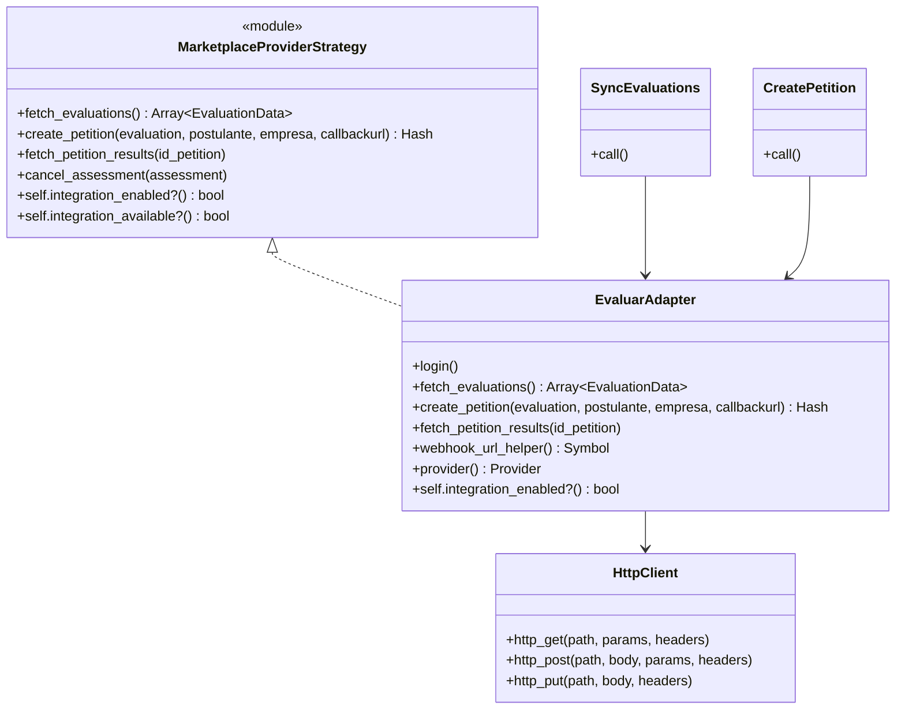
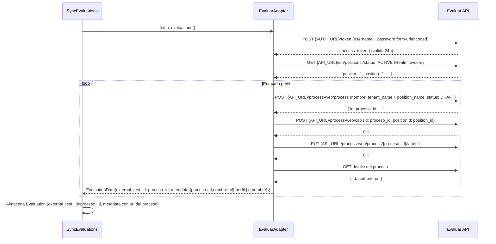
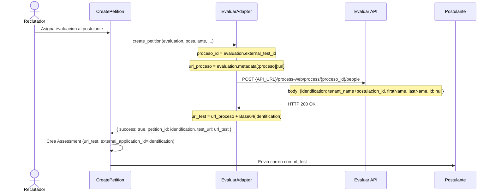
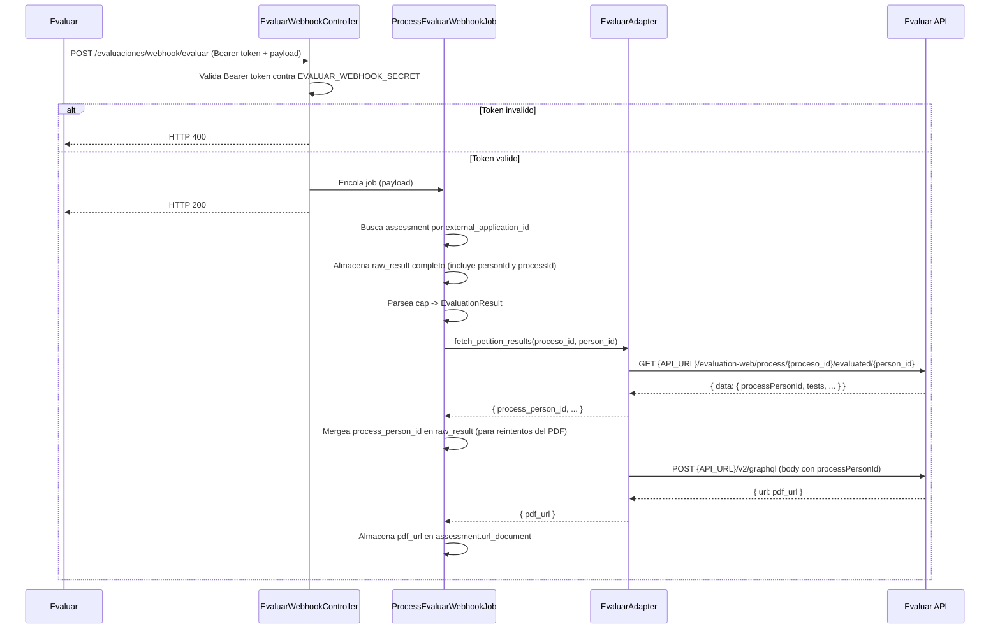

# Misión: Alta de Evaluar como Proveedor Marketplace

**Track:** Nuevos Proveedores Marketplace de Evaluaciones
**Epic:**
**Owner:**
**Reviewer:**
**Status:** draft
**Dependencias:** none

## Objetivo

Integrar Evaluar al catálogo marketplace de Buk implementando el adapter, webhook asíncrono y registro del proveedor, para que el flujo completo de asignación, envío y recepción de resultados funcione de punta a punta.

## Contexto

El pack `evaluations` tiene un patrón establecido para proveedores marketplace: adapter que implementa `MarketplaceProviderStrategy` + webhook controller + servicio de procesamiento, todo registrado en `ProviderStrategyResolver::STRATEGIES` y `EnsureProviders::PROVIDERS_CONFIG`. Hirint y EB Metrics siguen este patrón. Los servicios de orquestación existentes (`SyncEvaluations`, `CreatePetition`, `UpdateAssessment`) se reutilizan sin modificación.

Evaluar tiene dos diferencias relevantes respecto a los proveedores existentes:

1. **Proceso se crea en la sincronización, no en la asignación.** Durante `fetch_evaluations`, el adapter crea un proceso en Evaluar por cada position activa (4 llamadas API: crear en DRAFT, asignar perfil, lanzar, obtener URL). La `url` del proceso se persiste en `evaluation.metadata`. Cuando el reclutador asigna un candidato, `create_petition` solo registra a esa persona en el proceso ya existente (1 llamada), y la URL del candidato se construye localmente: `url_proceso + Base64(identification)`. El campo `evaluation.metadata` es el mecanismo que conecta ambos flujos.

2. **Webhook asíncrono** (ver ADR `ADR/20260520_webhook-evaluar-async.md`). A diferencia de Hirint y EB Metrics, el controller de Evaluar encola un job Sidekiq y responde HTTP 200 de inmediato. El procesamiento real (buscar assessment, almacenar resultados, obtener PDF vía GraphQL) ocurre en background. Decisión tomada porque el flujo de resultados requiere 3+ llamadas HTTP externas y puede recibir volumen alto en procesos de selección masivos.

Variables de entorno requeridas: `EVALUAR_USERNAME`, `EVALUAR_PASSWORD`, `EVALUAR_API_URL`, `EVALUAR_AUTH_URL`, `EVALUAR_WEBHOOK_SECRET`.

### Nomenclatura Evaluar → Buk

En Evaluar, el catálogo de pruebas se llama "perfil" (endpoint `/cm/positions`). Cada proceso agrupa un perfil y un conjunto de candidatos.

| Concepto | Buk | Evaluar | Notas |
| :---- | :---- | :---- | :---- |
| Evaluación (ítem del catálogo) | `Evaluations::Evaluation` | `proceso` | `evaluation.external_test_id = proceso_id`. El perfil que configura el proceso se almacena en `evaluation.metadata`. |
| Relación candidato-evaluación | `Evaluations::Assessment` | Candidato asignado a un proceso | Se crea al asignar la prueba; se actualiza con resultados cuando llega el webhook. |
| ID único del candidato | `assessment.external_application_id` | `identification` | `tenant_name + postulacion_id`. Buk lo envía al registrar el candidato; Evaluar lo usa como token de acceso. |
| URL de acceso del candidato | `assessment.url_test` | — | Construida en Buk: `process.url + Base64(identification)`. |
| Resultado | `Evaluations::EvaluationResult` | `components[0]["value"]` del webhook | Un único registro por assessment: `key_name: tipo del componente`, `value: components[0]["value"]`. |
| Reporte PDF | `assessment.url_document` | URL de `POST /v2/graphql` | Buk la descarga y almacena. |

## Historias de Usuario

### Historia 1 — Sincronización del catálogo de Evaluar (P1)

El sistema puede obtener y persistir el catálogo de evaluaciones disponibles en Evaluar. El adapter autentica con `POST {AUTH_URL}/token` (form-urlencoded, JWT válido 24 h), lista los perfiles activos con `GET {API_URL}/cm/positions?status=ACTIVE` y por cada position ejecuta: crear proceso en DRAFT, asignar el perfil, lanzar el proceso y obtener la URL. Cada proceso en Evaluar se persiste como una `Evaluation` en Buk con `external_test_id = proceso_id` y `metadata = { proceso: {id, nombre, url}, perfil: {id, nombre} }`. Una vez sincronizado, un reclutador ve las pruebas de Evaluar como opciones disponibles en el flujo de asignación de evaluaciones.

**Prueba Independiente:** Ejecutar `SyncEvaluations.call(provider_name: 'Evaluar')` contra el sandbox de Evaluar y verificar que se crean registros `Evaluation` con el proveedor Evaluar y `metadata` con la URL del proceso.

**Escenarios de Aceptación:**
1. **Dado** que Evaluar tiene N perfiles activos y las credenciales son válidas, **Cuando** se ejecuta la sincronización del catálogo, **Entonces** se crean N registros `Evaluation` asociados al proveedor Evaluar con `external_test_id` y `metadata` correctos.
2. **Dado** que ya existen evaluaciones de Evaluar sincronizadas, **Cuando** se ejecuta la sincronización nuevamente, **Entonces** los registros existentes se actualizan (no se duplican).
3. **Dado** que las credenciales de Evaluar son inválidas, **Cuando** se ejecuta la sincronización, **Entonces** el error se reporta a Sentry y no se modifica el catálogo existente.

---

### Historia 2 — Asignación y envío al candidato (P1)

El reclutador selecciona una evaluación de Evaluar en el flujo de asignación de un proceso de selección. El adapter registra al candidato en el proceso existente con `POST /process-web/process/{proceso_id}/people` usando `identification: tenant_name+postulacion_id`. La respuesta de Evaluar es solo HTTP 200 OK. La URL del candidato se construye localmente como `url_proceso + Base64(identification)` y se almacena en `assessment.url_test`. El candidato recibe un correo con ese enlace. No se realizan llamadas adicionales a la API de Evaluar en este paso.

**Prueba Independiente:** Crear un assessment de Evaluar en staging y verificar que el candidato recibe el correo con una URL válida que abre la prueba correcta en Evaluar.

**Escenarios de Aceptación:**
1. **Dado** que existe una evaluación de Evaluar sincronizada y un candidato en un proceso de selección, **Cuando** el reclutador asigna la evaluación, **Entonces** se crea un `Assessment` con `url_test` construida correctamente y `external_application_id = identification`.
2. **Dado** que se creó el assessment, **Cuando** el sistema envía la notificación, **Entonces** el candidato recibe un correo con el enlace a su prueba en Evaluar.
3. **Dado** que ya existe un assessment pendiente o completado para ese candidato en esa evaluación, **Cuando** el reclutador intenta asignarla nuevamente, **Entonces** el sistema retorna error `AssessmentAlreadyExistsError` sin crear duplicados.

---

### Historia 3 — Recepción de resultados vía webhook (P1)

Cuando un candidato completa su prueba en Evaluar, el proveedor llama a `POST /evaluaciones/webhook/evaluar` con un Bearer token y el payload del resultado. El controller valida el token contra `EVALUAR_WEBHOOK_SECRET`, encola `ProcessEvaluarWebhookJob` y responde HTTP 200 de inmediato. El job busca el assessment por `external_application_id` (el `identification` enviado en `/people`), almacena `raw_result`, parsea `EvaluationResult`, obtiene el detalle del evaluado con `GET /evaluation-web/process/{processId}/evaluated/{personId}`, mergea `process_person_id` en `raw_result` y solicita el PDF vía `POST /v2/graphql`. La URL del PDF se almacena en `assessment.url_document`. El resultado queda visible para el reclutador en la plataforma.

**Prueba Independiente:** Enviar un payload de webhook simulado al endpoint con un Bearer token válido y verificar que el assessment queda en estado `completed` con `raw_result` y `url_document` poblados.

**Escenarios de Aceptación:**
1. **Dado** que existe un assessment pendiente con `external_application_id` que coincide con el `identification` del webhook, **Cuando** Evaluar envía el webhook con token válido, **Entonces** el controller responde HTTP 200 de inmediato y el job actualiza el assessment a `completed` con resultados.
2. **Dado** que el webhook llega con un Bearer token inválido, **Cuando** el controller lo recibe, **Entonces** responde HTTP 400 sin procesar el payload.
3. **Dado** que el webhook llega con un `identification` que no corresponde a ningún assessment, **Cuando** el job lo procesa, **Entonces** el error `AssessmentNotFoundError` se reporta a Sentry con contexto del payload.
4. **Dado** que la API de Evaluar no tiene el PDF disponible aún, **Cuando** el job intenta obtenerlo, **Entonces** el error se loguea como warning, el assessment queda `completed` con resultados disponibles, y `url_document` queda en nil sin romper el flujo.

---

## Especificación Técnica

### Diagramas

#### Componentes a crear

| Componente | Clase | Patrón de referencia |
|------------|-------|---------------------|
| Adapter | `Evaluations::Adapters::Evaluar` | `Adapters::Hirint` |
| Webhook controller | `Evaluations::Webhooks::EvaluarController` | `Webhooks::HirintController` |
| Job de webhook | `Evaluations::ProcessEvaluarWebhookJob` | `ApplicationJob` del pack |
| Servicio de procesamiento | `Evaluations::ProcessEvaluarWebhook` | `ProcessHirintWebhook` |
| Parser | `Evaluations::Parsers::Evaluar::DefaultParser` | `ParserResolver` (convención de nombre) |

No se crean tablas nuevas. Los campos relevantes ya existen en `evaluations` (`metadata`, `external_test_id`) y en `assessments` (`external_application_id`, `url_test`, `url_document`, `raw_result`).

#### Diagrama de clases

#### Diagrama de secuencia — Sincronización del catálogo

#### Diagrama de secuencia — Asignación al postulante

#### Diagrama de secuencia — Webhook y resultados

### APIs

**Nueva ruta en Buk:**

`POST /evaluaciones/webhook/evaluar` — no requiere autenticación de sesión (llamada externa de Evaluar). La seguridad la provee el Bearer token validado contra `EVALUAR_WEBHOOK_SECRET`. Se registra en `config/routes/evaluations.rb` omitiendo verificación CSRF y de sesión, igual que Hirint y EB Metrics.

**APIs externas consumidas (Evaluar):**

Todas las llamadas requieren header `Realm: evcore`.

| Método | Endpoint | Cuándo se usa |
|--------|----------|---------------|
| POST | `{EVALUAR_AUTH_URL}/token` | Autenticación al inicio de cada flujo |
| GET | `{EVALUAR_API_URL}/cm/positions?status=ACTIVE` | Sincronización: listar perfiles disponibles |
| POST | `{EVALUAR_API_URL}/process-web/process` | Sincronización: crear proceso en DRAFT por cada perfil |
| POST | `{EVALUAR_API_URL}/process-web/cap` | Sincronización: asignar positionId al proceso |
| PUT | `{EVALUAR_API_URL}/process-web/process/{id}/launch` | Sincronización: activar proceso (DRAFT → LAUNCHED) |
| POST | `{EVALUAR_API_URL}/process-web/process/{id}/people` | Asignación: agregar candidato al proceso |
| GET | `{EVALUAR_API_URL}/evaluation-web/process/{proceso_id}/evaluated/{person_id}` | Webhook: obtener detalle de resultados del evaluado |
| POST | `{EVALUAR_API_URL}/v2/graphql` | Webhook: solicitar URL del PDF del reporte |

### Infraestructura

No se requiere apoyo de SRE. Se reutiliza la infraestructura existente del pack Evaluations.

| Variable | Descripción |
|----------|-------------|
| `EVALUAR_USERNAME` | Usuario de Buk en la plataforma Evaluar |
| `EVALUAR_PASSWORD` | Contraseña del usuario |
| `EVALUAR_API_URL` | URL base para el flujo de evaluaciones |
| `EVALUAR_AUTH_URL` | URL de autenticación (emisión de JWT) |
| `EVALUAR_WEBHOOK_SECRET` | Bearer token compartido entre Evaluar y Buk |

**Seguridad:**

- **Webhook:** Bearer token validado contra `EVALUAR_WEBHOOK_SECRET`. Requests con token inválido se rechazan con HTTP 400 antes de procesar cualquier dato.
- **Endpoint sin sesión:** Omite verificación CSRF y de sesión (igual que Hirint y EB Metrics). La seguridad la provee la validación del token.
- **Credenciales:** Solo en variables de entorno; no se persisten en base de datos.
- **Feature flag:** `seleccion_evaluar_integration` controla la visibilidad del proveedor en UI.

**Monitoreo (Sentry):**

| Error | Causa |
|-------|-------|
| `InvalidJwtError` | JWT corrupto o clave incorrecta |
| `AssessmentNotFoundError` | Webhook con `identification` que no corresponde a ningún assessment |
| `UnauthorizedError` | Bearer token inválido |
| `StoreAssessmentDocument::DocumentUploadError` | Fallo al almacenar el PDF |

## Alternativas de Solución

### Adapter: patrón existente vs servicio dedicado

Ver la decisión de webhook asíncrono en [`ADR/20260520_webhook-evaluar-async.md`](ADR/20260520_webhook-evaluar-async.md).

Para la integración del adapter se evaluaron dos alternativas:

**Alternativa 1 — `EvaluarAdapter` dentro del patrón Adapter+Strategy (elegida)**

Implementar `Evaluations::Adapters::Evaluar` que incluye `MarketplaceProviderStrategy`, encapsulando el flujo multi-paso dentro de `fetch_evaluations` y `create_petition`. Los servicios de orquestación se reutilizan sin modificación. El proceso en Evaluar se crea durante la sincronización, no durante la asignación: esto permite que `create_petition` ejecute una sola llamada API y construya la URL del candidato localmente.

**Pros:** cero cambios a servicios y controladores existentes; consistente con Hirint y EB Metrics; complejidad del flujo multi-paso encapsulada en el adapter.

**Alternativa 2 — Servicio dedicado fuera del patrón**

Crear un módulo separado con sus propios servicios de orquestación, desacoplado de `MarketplaceProviderStrategy`.

**Pros:** libertad para modelar el flujo sin ajustarse a la interfaz del strategy.

**Contras:** duplica lógica ya probada, rompe la consistencia arquitectónica, mayor superficie de mantenimiento. Descartada.

## Riesgos

| Riesgo | Probabilidad | Impacto | Mitigación |
|--------|-------------|---------|------------|
| Cambios en la API de Evaluar sin aviso previo | Media | Alto | `raw_result` almacena el payload completo para reprocesar; parser resiliente que ignora campos faltantes; errores a Sentry con contexto completo |
| Alto volumen de webhooks simultáneos en proceso masivo | Baja | Alto | Procesamiento asíncrono: controller responde HTTP 200 en <10 ms; Sidekiq absorbe picos; reintentos automáticos para fallos transitorios |

## Instrumentación para Métricas

El flujo de envío de pruebas cuenta con Amplitude ya implementado — no se requiere instrumentación adicional en ese flujo.

Esta misión agrega métricas de costos en PAR para seguimiento del uso mensual de la integración con Evaluar (ver T11 en `2_jira-cards.md`).

## Documentación

No se modifica documentación existente — esta misión agrega un nuevo proveedor sin alterar interfaces ni contratos del pack.

- [ ] Clases, servicios y métodos importantes documentados en el código

## Fuera de Alcance

- Configuración de credenciales de Evaluar desde la UI de administración.
- Soporte de Evaluar en la API pública de Buk.

## Preguntas Abiertas

- ¿El nombre del feature flag es `sel_evaluar_integration` (convención del pack: prefijo `sel_`) o `seleccion_evaluar_integration` (como propone el análisis técnico)?
- ¿Existe un ambiente sandbox de Evaluar para validar el flujo completo antes de producción?
