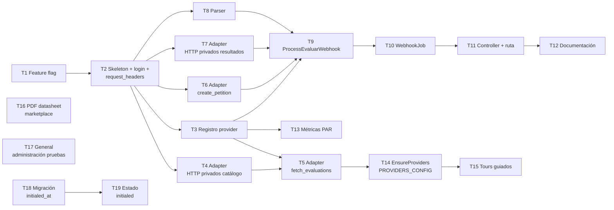

# Cards Jira — Alta de Evaluar como Proveedor Marketplace

**Epic:**
**Tablero:** SEL
**Tamaño del equipo:** 2 devs

## Mapa de Ejecución

T4, T6, T7 y T8 arrancan desde T2 — son métodos del adapter y el parser, todos testeables en aislamiento sin provider en BD. `ParserResolver` usa string-based resolution, no la constante del provider. T4 → T5 son secuenciales (flujo catálogo). T3 desbloquea T9 (los servicios usan `ProviderStrategyResolver` que necesita la constante) y T13 (query usa `EVALUAR_PROVIDER_NAME`). T9 depende de T3+T6+T7+T8. T14 se agrega al final para evitar que el seed dispare `SyncEvaluations` antes de que `fetch_evaluations` esté implementado. T15 depende de T14 (Evaluar debe estar disponible en UI). T16 y T17 son independientes — T16 es coordinación externa y T17 es placeholder bloqueado por misión externa. T18 y T19 son independientes del flujo principal — pueden desarrollarse en paralelo con cualquier otra tarea.

---

## T1 — Feature flag `seleccion_evaluar_integration`

**Tipo:** Task
**Estimación:** 30 min

**Resumen:** Registrar el feature flag de Evaluar que controla si el proveedor es visible en UI y acepta nuevas peticiones. Pre-requisito de T2: sin este flag, `integration_enabled?` del adapter no puede activarse.

**Criterios de Aceptación:**
- `seleccion_evaluar_integration` agregado a `feature_flag.yml` (o donde el pack define sus flags).
- Flag creado en Flipper (desactivado por defecto).
- `Evaluations::FeatureFlags` expone el método `seleccion_evaluar_integration_enabled?` usando `Buk::Feature.enabled?(:seleccion_evaluar_integration)`.

---

## T2 — Skeleton de `Evaluations::Adapters::Evaluar` + `login` + `request_headers`

**Tipo:** Task
**Estimación:** 3h

**Resumen:** Crear el archivo del adapter con todos los métodos públicos como stubs e implementar `login` y el método privado `request_headers`. Estos dos son dependencia compartida de T4, T6 y T7 — al implementarlos aquí, los dos devs pueden trabajar en paralelo desde T3 sin bloquearse.

**Criterios de Aceptación:**
- Existe `Evaluations::Adapters::Evaluar` que incluye `MarketplaceProviderStrategy`.
- Stubs para los métodos públicos (`raise NotImplementedError` o `nil` según convención del pack): `fetch_evaluations`, `create_petition`, `fetch_petition_results`.
- `login` implementado: hace `POST {EVALUAR_AUTH_URL}/token` (form-urlencoded: `username`, `password`) y almacena el JWT en `@auth_token` (variable de instancia). No hay caché entre requests — el servicio llama `adapter.login` antes de cada operación.
- `request_headers` implementado como método privado: retorna `{ "Authorization" => "Bearer #{@auth_token}", "Realm" => "evcore" }`. Es la única fuente de headers para todas las llamadas HTTP del adapter.
- `webhook_url_helper`, `provider` y `self.integration_enabled?` implementados con valores concretos.
- El adapter usa `Evaluations::HttpClient` directamente. Patrón de referencia: `Adapters::EbMetrics`.
- El archivo existe en `packs/recruiting/evaluations/app/lib/evaluations/adapters/evaluar.rb`.
- Tests para `login`: camino feliz y error de autenticación.
- Validación local: `adapter.login` ejecuta correctamente contra credenciales de staging de Evaluar.

---

## T3 — Registrar constante EVALUAR_PROVIDER_NAME y entrada en ProviderStrategyResolver

**Tipo:** Task
**Estimación:** 2h

**Resumen:** Definir la constante `EVALUAR_PROVIDER_NAME` y registrar el adapter en `ProviderStrategyResolver`. Esto permite que los servicios resuelvan el adapter dinámicamente (`ProviderStrategyResolver.for_marketplace("Evaluar")`) y que el provider quede disponible en BD. Sin este paso, cualquier operación lanza `AdapterNotFoundError`.

**Criterios de Aceptación:**
- `Evaluations::Providers` tiene la constante `EVALUAR_PROVIDER_NAME` y el método helper `evaluar_provider` que retorna el provider de BD.
- `ProviderStrategyResolver::STRATEGIES` tiene la entrada `[EVALUAR_PROVIDER_NAME, MARKETPLACE_SCOPE] => Evaluations::Adapters::Evaluar`.
- Tests en `provider_strategy_resolver_test.rb` pasan con el nuevo caso.
- Validación local: `ProviderStrategyResolver.for_marketplace("Evaluar")` retorna el adapter correcto.
- **No incluir** la entrada en `EnsureProviders::PROVIDERS_CONFIG` — eso es T14.

---

## T4 — Métodos privados HTTP del `EvaluarAdapter` para creación de procesos

**Tipo:** Task
**Estimación:** 4h

**Resumen:** Implementar los métodos privados del adapter que encapsulan cada llamada HTTP a Evaluar necesaria para el flujo de creación de procesos. Cada método es independiente, tiene su propio stub de respuesta y su propio test unitario. Son el fundamento sobre el que T5 construye `fetch_evaluations`.

**Métodos a implementar:**
- `fetch_positions` → `GET /cm/positions?status=ACTIVE` — retorna array de `{ id:, name: }`.
- `create_process(position)` → `POST /process-web/process` — retorna `{ id: proceso_id }`.
- `assign_cap(process_id, position_id)` → `POST /process-web/cap` — confirma asignación.
- `launch_process(process_id)` → `PUT /process-web/process/{id}/launch` — activa el proceso (`DRAFT → LAUNCHED`).
- `get_process_detail(process_id)` → `GET /process-web/process/{id}` — retorna `{ id:, name:, url: }`.

**Criterios de Aceptación:**
- Cada método usa `request_headers` (implementado en T2) para todas las llamadas HTTP.
- Cada método tiene tests unitarios con `HttpClient` stubbeado: camino feliz y error HTTP del proveedor.
- Los métodos son privados — no forman parte de la interfaz pública del adapter.

---

## T5 — `EvaluarAdapter#fetch_evaluations` + idempotencia

**Tipo:** Task
**Estimación:** 4h
**Depende de:** T4

**Resumen:** Implementar el método público `fetch_evaluations` que orquesta los métodos privados de T4. Los procesos no existen previamente en Evaluar — este flujo los crea. Incluye lógica de idempotencia para que re-ejecuciones no dupliquen procesos en Evaluar ni en BD.

**Criterios de Aceptación:**
- `fetch_evaluations` retorna un array de `EvaluationData`.
- Cada `EvaluationData` tiene:
  - `external_test_id` = ID del proceso creado en Evaluar.
  - `metadata` almacena la respuesta completa de cada llamada a Evaluar, no solo campos mínimos:
    - `metadata[:proceso]` = respuesta completa de `get_process_detail` (incluye `id`, `name`, `url` y cualquier otro campo que retorne la API).
    - `metadata[:perfil]` = entrada completa del array de `fetch_positions` (incluye `id`, `name` y cualquier otro campo disponible).
  - Almacenar la respuesta íntegra evita re-llamar a Evaluar si en el futuro se necesitan campos adicionales.
- Solo se procesan perfiles con `status=ACTIVE`.
- **Idempotencia:** antes de crear un proceso para un perfil, consulta si ya existe una `Evaluation` en BD con ese `perfil.id` en `metadata`. Si existe, retorna los datos actuales sin llamar a Evaluar.
- Si un perfil falla durante el loop, el error se reporta a Sentry y el loop continúa (no aborta la sincronización).
- Tests con `HttpClient` stubbeado: camino feliz con varios perfiles, perfil ya existente (idempotencia) y fallo en un perfil del loop.
- Validación local: ejecutar `SyncEvaluations` dos veces seguidas produce el mismo resultado en BD sin duplicar procesos en Evaluar.

---

## T6 — `EvaluarAdapter#create_petition`

**Tipo:** Task
**Estimación:** 4h

**Resumen:** Implementar el método `create_petition` del adapter. Asigna un candidato a un proceso en Evaluar y retorna la URL personalizada de acceso a la prueba.

**API de referencia (Evaluar):**
- `POST {EVALUAR_API_URL}/process-web/process/{proceso_id}/people` — asigna candidato. Evaluar responde HTTP 200 sin body útil.
- La URL de la prueba se construye localmente: `evaluation.metadata[:proceso][:url] + Base64.strict_encode64(identification)`.

**Criterios de Aceptación:**
- `create_petition` retorna `{ success: true, petition_id: identification, test_url: url_test }`.
- `identification` se forma como `tenant_name + postulacion_id`.
- Tests con `HttpClient` stubbeado: camino feliz y error HTTP del proveedor.
- Validación local: flujo completo `CreatePetition` service → `adapter.login` → `adapter.create_petition` ejecuta sin errores y el candidato queda asignado en Evaluar staging.

---

## T7 — Métodos privados HTTP del `EvaluarAdapter` para resultados

**Tipo:** Task
**Estimación:** 4h

**Resumen:** Implementar los 2 métodos privados del adapter que encapsulan las llamadas HTTP necesarias para obtener el resultado del evaluado y el PDF del reporte. Son independientes de T6 — pueden desarrollarse en paralelo desde T3. T9 (`ProcessEvaluarWebhook`) los llama directamente al procesar el webhook.

**Métodos a implementar:**
- `get_process_person(process_id, person_id)` → `GET {EVALUAR_API_URL}/evaluation-web/process/{process_id}/evaluated/{person_id}` — retorna `processPersonId` del evaluado.
- `fetch_pdf_url(process_person_id)` → `POST {EVALUAR_API_URL}/v2/graphql` con `processPersonId` — retorna la URL del PDF del reporte.

**Criterios de Aceptación:**
- Cada método usa `request_headers` (implementado en T2) para todas las llamadas HTTP.
- `get_process_person`: retorna nil si la respuesta no incluye `processPersonId` (sin lanzar excepción).
- `fetch_pdf_url`: retorna nil si el PDF no está disponible aún (sin lanzar excepción).
- Cada método tiene tests unitarios con `HttpClient` stubbeado: camino feliz y respuesta vacía/inesperada.
- T9 los consume a través del adapter.
- Validación local: con un assessment completado en Evaluar, `get_process_person` retorna un `processPersonId` válido y `fetch_pdf_url` retorna una URL de PDF.

---

## T8 — `Evaluations::Parsers::Evaluar::DefaultParser`

**Tipo:** Task
**Estimación:** 3h

**Resumen:** Crear el parser que transforma el `raw_result` del webhook en un registro `EvaluationResult`. Puede desarrollarse en paralelo con T4–T7 ya que solo depende de la estructura del payload del webhook de Evaluar.

**Criterios de Aceptación:**
- Existe `Evaluations::Parsers::Evaluar::DefaultParser` compatible con el contrato de `ParserResolver`.
- Parsea un único `EvaluationResult` por assessment:
  - `key_name` = `raw_result["components"][0]["type"]["Label"]` (ej: `"COMPETENCIAS"`).
  - `value` = `raw_result["components"][0]["value"]` (ej: `40`).
  - `data_type` según convención del pack.
- Si `components` está vacío o los campos faltan, retorna array vacío sin lanzar excepción.
- `ParserResolver.find_parser_for(provider_name: 'Evaluar', ...)` retorna este parser.
- Tests con el payload real del webhook de Evaluar y con payload incompleto.

---

## T9 — `Evaluations::ProcessEvaluarWebhook`

**Tipo:** Task
**Estimación:** 6h

**Resumen:** Servicio que orquesta el procesamiento completo del webhook: buscar el assessment, almacenar el resultado crudo, parsear `EvaluationResult`, obtener el detalle del evaluado y almacenar el PDF. Patrón de referencia: `ProcessHirintWebhook`. Depende de T6, T7 y T8.

**Criterios de Aceptación:**
- Busca el `Assessment` por `external_application_id` usando `payload["identification"]`.
- Actualiza `assessment.status` a `:completed` y `assessment.completed_at` (convirtiendo `finishedDate` de milisegundos a `DateTime`).
- Almacena el payload completo en `assessment.raw_result` (incluye `personId` y `processId` para uso posterior).
- Llama a `Evaluations::Parsers::Evaluar::DefaultParser` para crear los registros `EvaluationResult`.
- Llama a `adapter.get_process_person(processId, personId)` usando los valores del `raw_result` para obtener `processPersonId`.
- Mergea `process_person_id` en `raw_result` (para que reintentos del PDF no requieran re-llamar este endpoint).
- Llama a `adapter.fetch_pdf_url(process_person_id)` para obtener la URL del reporte.
- Almacena `pdf_url` en `assessment.url_document`.
- **Si el assessment no se encuentra:** lanza `AssessmentNotFoundError` (reportado a Sentry con contexto del payload).
- **Si el PDF no está disponible:** loguea warning, el assessment queda `:completed` con `url_document` nil (no rompe el flujo).
- Validación local: simular un payload de webhook real y verificar que el assessment queda `:completed` con `EvaluationResult` y `url_document` correctos.

---

## T10 — `Evaluations::ProcessEvaluarWebhookJob`

**Tipo:** Task
**Estimación:** 3h

**Resumen:** Job que recibe el payload del webhook y delega a `ProcessEvaluarWebhook`. Separa el transporte asíncrono de la lógica de negocio.

**Criterios de Aceptación:**
- Hereda de `ApplicationJob` del pack.
- `queue: :default`.
- Recibe el payload del webhook como argumento y llama `ProcessEvaluarWebhook.call(payload: payload)`.
- Errores no rescatados por el servicio propagan el reintento automático de Sidekiq.
- Tests: verifica que el job llama al servicio con el payload correcto.
- Validación local: el job se encola y procesa correctamente en Sidekiq local.

---

## T11 — `Evaluations::Webhooks::EvaluarController` + ruta

**Tipo:** Task
**Estimación:** 4h

**Resumen:** Crear el endpoint público que recibe las notificaciones de Evaluar cuando un candidato completa una prueba. Valida el Bearer token, encola el job y responde HTTP 200 de inmediato. Patrón de referencia: `Webhooks::HirintController`.

**Criterios de Aceptación:**
- Ruta registrada en `config/routes/evaluations.rb` como `post :evaluar, to: 'webhooks/evaluar#create'`.
- El endpoint omite verificación CSRF y de sesión (llamada externa de Evaluar), igual que Hirint y EB Metrics.
- `EvaluarController#create` valida el header `Authorization: Bearer {token}` contra `ENV["EVALUAR_WEBHOOK_SECRET"]`.
  - Token inválido o ausente → HTTP 400 sin procesar el payload.
  - Token válido → encola `ProcessEvaluarWebhookJob.perform_later(payload)` y responde HTTP 200.
- Tests: token válido (HTTP 200 + job encolado), token inválido (HTTP 400 + job NO encolado), token ausente (HTTP 400).

---

## T12 — Documentación

**Tipo:** Task
**Estimación:** 3h

**Resumen:** Documentar todo lo necesario para que el equipo de operaciones pueda configurar y activar la integración en producción sin necesidad de leer el código.

**Criterios de Aceptación:**
- **Variables de entorno requeridas:** `EVALUAR_USERNAME`, `EVALUAR_PASSWORD`, `EVALUAR_API_URL`, `EVALUAR_AUTH_URL`, `EVALUAR_WEBHOOK_SECRET` — descripción y ejemplo de cada una.
- **APIs externas consumidas:** tabla con método, endpoint, headers requeridos (`Realm: evcore`, `Authorization: Bearer`) y estructura de request/response para cada llamada.
- **Configuración del webhook en Evaluar:** URL del endpoint de Buk (`POST /evaluaciones/webhook/evaluar`), cómo configurar el Bearer token en el panel de Evaluar.
- **Pasos de activación en producción:** orden sugerido (1. agregar ENV vars, 2. ejecutar sincronización manual, 3. activar feature flag `seleccion_evaluar_integration`).

---

## T13 — Métricas de costos en PAR

**Tipo:** Task
**Estimación:** 1h
**Depende de:** T3 (necesita `EVALUAR_PROVIDER_NAME` definida)

**Resumen:** Agregar 2 entradas al hash de `Par::UsabilidadSeleccionJob#extract_data_for_tenant`. No requiere crear un nuevo job — sigue el mismo patrón de `pruebas_prov_ebmetrics_enviadas/completadas`. Puede desarrollarse en paralelo con T6–T8 desde que T3 está mergeado.

**Archivo a modificar:** `packs/recruiting/core/app/jobs/par/usabilidad_seleccion_job.rb`

**Criterios de Aceptación:**
- `format_metric(:pruebas_prov_evaluar_enviadas, all_month)` → query sobre `Evaluations::Assessment` join provider con `EVALUAR_PROVIDER_NAME` y `scope: :marketplace`, filtrado por `created_at: all_month`.
- `format_metric(:pruebas_prov_evaluar_completadas, all_month)` → misma query con `.where(status: :completed)`.
- Tests: el job incluye ambas métricas en su output para el mes de referencia.
- Validación en staging: crear y completar un assessment de Evaluar y verificar que el job reporta los valores correctos.

---

## T14 — Habilitar sync automático de Evaluar en `EnsureProviders`

**Tipo:** Task
**Estimación:** 30 min
**Depende de:** T5 (`fetch_evaluations` implementado)

**Resumen:** Agregar la entrada de Evaluar a `PROVIDERS_CONFIG` para que el seed de selección cree el provider y dispare la sincronización automáticamente. Se deja al final deliberadamente — `EnsureProviders` llama a `SyncEvaluations` para cualquier provider marketplace sin evaluaciones, por lo que agregar esta entrada antes de que T5 esté listo causaría un `NotImplementedError` en el seed.

**Archivo a modificar:** `packs/recruiting/evaluations/app/services/evaluations/ensure_providers.rb`

**Criterios de Aceptación:**
- `PROVIDERS_CONFIG` incluye `evaluar: { name: 'Evaluar', scopes: [:marketplace] }`.
- El seed de selección ejecuta sin errores y el provider Evaluar queda creado en BD con sus evaluaciones sincronizadas.
- Tests: `EnsureProviders` crea el provider Evaluar y llama a `SyncEvaluations` cuando no hay evaluaciones.

---

## T15 — Tours guiados para integración Evaluar

**Tipo:** Task
**Estimación:** 3h
**Depende de:** T14 (Evaluar visible en UI)

**Resumen:** Implementar 2 tours guiados que orientan al usuario en el flujo de agregar una prueba de Evaluar. Deben activarse solo cuando `seleccion_evaluar_integration` está habilitado.

**Tours a implementar:**

- **Tour 1 — Botón "Agregar prueba":** Se muestra en el tab de Pruebas dentro del proceso de selección, apuntando al botón "Agregar prueba". Introduce al usuario a la posibilidad de agregar evaluaciones externas.
- **Tour 2 — Sección Evaluar en el modal:** Se muestra dentro del modal de selección de pruebas, apuntando a la sección donde aparece Evaluar. Explica brevemente qué ofrece el proveedor y cómo proceder.

**Criterios de Aceptación:**
- Ambos tours se registran siguiendo la convención de tours guiados del pack de recruiting.
- Tour 1 aparece al primer ingreso al tab de Pruebas con el flag activo.
- Tour 2 aparece al abrir el modal de agregar prueba con el flag activo.
- Si el usuario ya vio el tour, no vuelve a aparecer (persistencia de estado).
- Tests: los tours se registran correctamente y respetan la condición del feature flag.

---

## T16 — Actualizar PDF datasheet de Pruebas en marketplace

**Tipo:** Task
**Estimación:** 2h

**Resumen:** En el marketplace de soluciones existe un datasheet (PDF) de Pruebas que necesita actualizarse. No es una tarea técnica de Evaluar — es una tarea de coordinación externa que se incluye aquí para no perderla de vista. El desarrollo es mínimo (actualizar una URL en un PR), pero depende de gestiones con terceros.

**Pasos:**
1. Coordinar con JESU para obtener el PDF actualizado.
2. Solicitar al equipo encargado del marketplace que lo suba/actualice.
3. Recibir la URL del PDF ya publicado.
4. Actualizar la URL en el código mediante PR.

**Criterios de Aceptación:**
- El PDF en marketplace apunta a la URL oficial actualizada.
- El PDF es accesible públicamente desde la URL configurada.

---

## T17 — General: integración con administración de pruebas

**Tipo:** Task
**Estimación:** por definir
**Bloqueada por:** misión de administración de pruebas (equipo externo)

**Resumen:** Existe una nueva misión de administración de pruebas que, al finalizar, habilitará funcionalidad que esta integración deberá incorporar. Esta tarjeta es un placeholder — no tiene desarrollo definido hasta recibir luz verde del equipo responsable de esa misión.

**Criterios de Aceptación:**
- Por definir una vez que la misión de administración de pruebas esté lista o notifique qué debe incorporarse.

---

## T18 — Migración: agregar columna `initiated_at` a `assessments`

**Tipo:** Task
**Estimación:** 1h

**Resumen:** Agregar la columna `initiated_at` (datetime, nullable) a la tabla `assessments` para registrar el timestamp en que el postulante inició una prueba. Requiere seguir el procedimiento de migraciones de Buk (`docs/migraciones/procedimiento-migraciones.md`).

**Criterios de Aceptación:**
- Migración crea la columna `initiated_at` como datetime nullable en `assessments`.
- El schema comment del modelo refleja la nueva columna.
- `rollback` de la migración ejecuta sin errores.

---

## T19 — Agregar estado `initiated` al enum de `Assessment`

**Tipo:** Task
**Estimación:** 3h
**Depende de:** T18

**Resumen:** Agregar el estado `initiated` al enum de `Assessment` para poder representar cuando un postulante ha iniciado una prueba. Permite manejar este estado de forma explícita en el modelo sin depender de lógica implícita.

**Archivos a modificar:**
- `packs/recruiting/evaluations/app/models/evaluations/assessment.rb` — agregar `initiated: 3` al enum y callback `set_initiated_at` (mismo patrón que `set_completed_at`).
- Archivo de locales del pack — agregar traducción para `initiated` (usada por `translate_enum :status`).
- `packs/recruiting/evaluations/app/services/evaluations/create_petition.rb` — actualizar `check_assessment_uniqueness!` para incluir `initiated` en los estados que bloquean una nueva asignación.

**Criterios de Aceptación:**
- `Assessment.statuses` incluye `initiated: 3`.
- Transicionar a `initiated` setea `initiated_at` automáticamente vía callback.
- `CreatePetition` lanza `AssessmentAlreadyExistsError` si ya existe un assessment `initiated` para la misma combinación.
- La traducción de `initiated` aparece correctamente en UI.
- Tests: callback setea `initiated_at`, `check_assessment_uniqueness!` bloquea status `initiated`.

