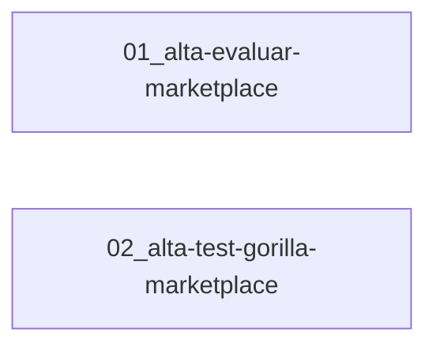

# Track: Nuevos Proveedores Marketplace de Evaluaciones

**Equipo:** Recruiting
**Tablero Jira:** SEL
**Jira Card:**
**Owner:**
**Reviewer:**
**Status:** draft

## Problema

El catálogo marketplace de evaluaciones tiene cobertura limitada: solo Hirint y EB Metrics están disponibles para todos los clientes. Los reclutadores no pueden asignar pruebas de Evaluar ni de TestGorilla (scope marketplace) desde Buk, lo que fragmenta el flujo de selección. Este track incorpora ambos proveedores al catálogo marketplace de forma que el ciclo completo — asignación, envío al candidato, respuesta y recepción de resultados vía webhook — ocurra íntegramente dentro de la plataforma.

## Notas de Investigación

- `EnsureProviders::PROVIDERS_CONFIG` es la fuente de verdad de qué providers existen en BD. TestGorilla ya figura ahí con `scopes: [:client_specific]`; agregar marketplace implica extender ese array.
- `ProviderStrategyResolver::STRATEGIES` es el único registro `(nombre, scope) → clase`. Sin entrada aquí el provider lanza `AdapterNotFoundError` en cualquier operación.
- `Evaluations::Providers` (API pública del pack) expone constantes de nombre y métodos helper por proveedor; deben agregarse para cada provider nuevo.
- `CreatePetition` construye la callback URL invocando `adapter.webhook_url_helper` — la ruta debe existir antes del primer envío a producción.
- `ParserResolver` tiene fallback automático a `DefaultParser` cuando no existe parser específico; no es bloqueante en la primera entrega de cada proveedor.
- TestGorilla `client_specific` usa `Evaluations::Strategies::TestGorilla`; el nuevo scope marketplace requiere una clase separada `Evaluations::Adapters::TestGorilla` — las dos coexisten sin tocarse.
- Autenticación del webhook: Hirint usa JWT firmado (`HIRINT_WEBHOOK_SECRET`); EB Metrics usa `callback_token` (key+token enviados en el `create_petition`). El mecanismo de Evaluar y TestGorilla marketplace depende del contrato de cada API — debe resolverse antes de implementar los controllers de webhook.

## Entidades de Dominio

| Entidad | Definición |
|---------|-----------|
| `Evaluations::Provider` | Proveedor de evaluaciones. Scope `marketplace` = catálogo compartido; `client_specific` = integración por cliente. Tabla `evaluation_providers`, único en `(name, scope)`. |
| `Evaluations::Evaluation` | Prueba del catálogo de un proveedor, sincronizada desde su API. Único en `(evaluation_provider_id, external_test_id)`. |
| `Evaluations::Assessment` | Instancia de prueba asignada a un candidato (`evaluable`) en una postulación (`contextable`). Almacena `external_application_id`, `url_test`, `url_result`, `raw_result`, `status`. |
| `Evaluations::Adapters::NombreProveedor` | Clase que implementa `MarketplaceProviderStrategy`: `fetch_evaluations`, `create_petition`, `fetch_petition_results`, `webhook_url_helper`, `provider`, `integration_enabled?`. |
| `Evaluations::ProcessNombreWebhook` | Servicio que recibe el payload del webhook, busca el `Assessment` por `external_application_id`, actualiza estado y almacena resultado. |

## Reglas de Negocio

- Todo proveedor marketplace debe estar declarado en `EnsureProviders::PROVIDERS_CONFIG` y en `ProviderStrategyResolver::STRATEGIES` antes de ser utilizable.
- El método `integration_enabled?` del adapter controla si el proveedor aparece en UI y acepta nuevas peticiones. Debe retornar `false` si las flags globales de marketplace están desactivadas.
- `CreatePetition` es transaccional: si la llamada a la API del proveedor falla, no se crea el `Assessment`. El `external_application_id` del `Assessment` es el `petition_id` retornado por el proveedor.
- No se agregan funcionalidades nuevas al flujo de evaluaciones existente; solo se conectan los nuevos proveedores al patrón ya establecido.
- La integración `client_specific` de TestGorilla no se modifica ni migra; ambas coexisten bajo el mismo nombre de proveedor pero distinto scope.

## Mapa de Misiones

Las dos misiones son independientes y se ejecutan en paralelo.

## Fuera de Alcance (nivel track)

- No se agregan funcionalidades nuevas al flujo de evaluaciones (más allá de conectar los dos proveedores).
- No se migra el código de integración `client_specific` de TestGorilla al scope marketplace.
- No se incluye reportería ni analytics de resultados de los nuevos proveedores.
- No se contempla configuración avanzada por cliente para estos proveedores.

## Notas de Arquitectura

- **Patrón a seguir:** `Evaluations::Adapters::Hirint` y `Evaluations::Adapters::EbMetrics` son la referencia para implementar los nuevos adapters marketplace.
- **Checklist por proveedor:** `PROVIDERS_CONFIG` → constante + helper en `Evaluations::Providers` → adapter en `Evaluations::Adapters` → entrada en `STRATEGIES` → webhook controller → webhook service → ruta en `config/routes/evaluations.rb`.
- **Webhook authentication:** el mecanismo (JWT, token-in-body, HMAC, etc.) lo dicta el contrato de la API de cada proveedor. Debe conocerse antes de implementar el webhook controller.
- **Parser:** `ParserResolver` hace fallback automático a `DefaultParser`; no es necesario implementar uno específico en la primera entrega. Si el proveedor retorna un formato estructurado que se quiera mostrar, se agrega `Parsers::NombreProveedor::DefaultParser` (el resolver lo encuentra por convención de nombre).
- **Feature flags:** patrón Hirint como referencia (`sel_hirint_integration` + flag global de marketplace). Decidir si Evaluar y TestGorilla marketplace tendrán FF propio o solo dependen del global — esta decisión debe tomarse antes de implementar `integration_enabled?` en cada adapter.

## Preguntas Abiertas

- ¿Evaluar y TestGorilla marketplace tendrán feature flag propio (estilo `sel_evaluar_integration`) o solo se controlan con el flag global de marketplace?
- ¿Cuál es el mecanismo de autenticación del webhook de Evaluar? ¿Y el de TestGorilla marketplace?
- ¿TestGorilla marketplace usa las mismas credenciales de API que la integración `client_specific`, o son cuentas separadas?
- ¿Evaluar tiene documentación de API pública disponible? ¿Quién es el contacto técnico del proveedor?

## Referencias

- Adapters de referencia: `packs/recruiting/evaluations/app/lib/evaluations/adapters/`
- Registro de strategies: `packs/recruiting/evaluations/app/services/evaluations/provider_strategy_resolver.rb`
- Config de providers: `packs/recruiting/evaluations/app/services/evaluations/ensure_providers.rb`
- API pública: `packs/recruiting/evaluations/app/public/evaluations/providers.rb`
- Rutas de webhooks: `packs/recruiting/evaluations/config/routes/evaluations.rb`
- Feature flags: `packs/recruiting/evaluations/app/public/evaluations/feature_flags.rb`
- Spec del track: `teams/recruiting/tracks/2026/0520_nuevos-proveedores-marketplace/spec-track.md`
