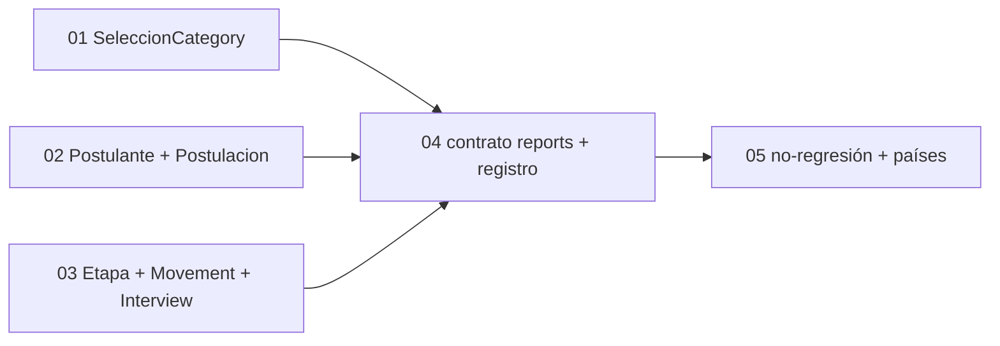

# Cards Jira — Migración de campos existentes a analytics_field

**Epic:** SEL-6810
**Tablero:** SEL
**Tamaño del equipo:** 1–2 devs backend

> **Contexto de implementación:** existe un POC en la rama `poc/SEL-6810-migracion-analytics-fields` (commit `3969e746`) que ya migró las 6 categorías y los 3 reports. Las decisiones, gotchas y SQL por campo están en `docs/analytics_recruiting_decisions.md` de esa rama. Estas cards productizan ese POC. Las estimaciones reflejan el peso real observado (solo `seleccion_category.rb` creció +744 líneas).
>
> **Regla transversal:** todo campo presente en `fields()` debe declararse con `analytics_field`; un campo sin declarar rompe el reporte que lo use. Los campos sin SQL viable se declaran igual, con `sql: nil` y `available_in: [:reports]`, conservando su `value:`/bloque (siguen en reportes, no aparecen en analytics). El POC dejó algunos campos apoyados en la resolución legacy (`get_value`/`send`); estas cards exigen declararlos todos.

## Mapa de Ejecución

> Las cards 01, 02 y 03 migran categorías independientes entre sí y corren en paralelo. La 04 depende de las tres porque su `relations`/`ASSOCIATIONS` referencian todas las categorías. La 05 valida sobre el conjunto ya registrado.

---

## 01 — Migrar `SeleccionCategory` a analytics_field

**Jira:** [SEL-6958](https://buk.atlassian.net/browse/SEL-6958)
**Tipo:** Task
**Sugerencia de asignación:** 1 dev backend
**Estimación:** 16h

**Resumen:** Declarar `analytics_field` (`origin`, `type`, `sql:`, `value:`, `available_in:`) en todos los campos de `SeleccionCategory.fields(...)`, incluyendo funnel, días hábiles con feriados, niveles de área y campos país-específicos.

**Criterios de Aceptación:**
- Todos los campos de `SeleccionCategory.fields(...)` tienen `analytics_field`; ninguno queda sin declarar.
- Los conteos (`numero_postulantes`, `numero_contratados`, `numero_descartados`) usan subquery `COUNT` correlacionado.
- `duracion_dias_habiles` cruza `holidays` + `holidays_locations` por `location_id`, materializando el rango de fechas en un subquery previo al `generate_series` (sin `MIN()/MAX()` dentro del `generate_series`).
- `duracion_dias_continuos` usa resta directa de fechas (`fecha_fin::date - fecha_inicio::date`), sin `EXTRACT(DAY FROM ...)`; `dias_transcurridos` usa `GREATEST(CURRENT_DATE - seleccions.created_at::date, 0)`.
- Los campos calculados sobre `Person` (`substitute_full_name`, `nombre_completo` de `supervisor`/`solicitado_por`) usan `CONCAT(p.last_name, ' ', p.segundo_apellido, ', ', p.first_name)` (+ `' (', p.rut, ')'` para `substitute_full_name`); `location` usa `locations.name`, no métodos Ruby como columna.
- Los campos de Brasil (`regimen_laboral`, `tipo_jornada`, `otros_tipo_jornada`, `admission_type`, `admission_indicative`, `article_22`) usan `CASE` SQL desde el enum `Job::Brasil`, con `country:` que retorne `nil` fuera de Brasil; `work_day_description` usa la columna directa `seleccions.work_day_description` (`country: :brasil`); `area_*_nivel_1..3` usan `first_level_id`/`second_level_id` de `areas`.
- `recruiter` (lista multivalor no expresable en SQL) se declara con `sql: nil` y `available_in: [:reports]`, conservando su `value:`/bloque.
- Tests cubren contexto analytics y reporte de cada campo, en tenants de Chile, Colombia y Brasil.

---

## 02 — Migrar `PostulanteCategory` y `PostulacionCategory`

**Jira:** [SEL-6959](https://buk.atlassian.net/browse/SEL-6959)
**Tipo:** Task
**Sugerencia de asignación:** 1 dev backend
**Estimación:** 10h

**Resumen:** Declarar `analytics_field` en los 26 campos de `PostulanteCategory` y los 10 de `PostulacionCategory`, incluyendo subqueries (`scorecard_score`, `employee_status`, `average_score`) y un `CASE` dependiente de `etapa_procesos.final_step`.

**Criterios de Aceptación:**
- Todos los campos de ambas categorías tienen `analytics_field`; los nombres usan `CONCAT` sobre `people`, no el método Ruby.
- `scorecard_score` y `average_score` usan subquery a `rapidfire_attempts`.
- `employee_status` usa subquery a `employees` con priorización (`ORDER BY CASE` activo > pendiente > inactivo `+ LIMIT 1`).
- `status` de postulación usa `CASE WHEN` con JOIN a `etapa_procesos.final_step`.
- `cv_url` (URL CarrierWave en runtime) y `notes_by_process_stage` (concatenación con lógica Ruby) se declaran con `sql: nil` y `available_in: [:reports]`, conservando su `value:`/bloque.
- Tests cubren contexto analytics y reporte por campo, incluyendo país donde aplique.

---

## 03 — Migrar `EtapaProcesoCategory`, `RecruitingMovementEventCategory` e `InterviewCategory`

**Jira:** [SEL-6960](https://buk.atlassian.net/browse/SEL-6960)
**Tipo:** Task
**Sugerencia de asignación:** 1 dev backend
**Estimación:** 10h

**Resumen:** Declarar `analytics_field` en `EtapaProcesoCategory` (5 campos), `RecruitingMovementEventCategory` (6) e `InterviewCategory` (8), incluyendo días hábiles a nivel de etapa/movimiento y extracción de horas.

**Criterios de Aceptación:**
- Todos los campos de las tres categorías tienen `analytics_field`; ninguno queda sin declarar.
- `stage_working_days` y `working_days_time` aplican el patrón de días hábiles + `holidays` resolviendo el `location_id`: `stage_working_days` vía `etapa_procesos → seleccions.location_id`; `working_days_time` vía `LATERAL recruiting_movement_events.to_stage_id → etapa_procesos → seleccions.location_id`.
- `stage_continuous_days`/`continuous_time` usan `CASE WHEN MIN IS NOT NULL AND MAX IS NOT NULL THEN (resta directa) ELSE NULL END` (sin `EXTRACT`).
- Los campos de hora de `InterviewCategory` (`start_time`, `end_time`, `duration`) se extraen como string `HH:MM` con `LPAD(EXTRACT(...))`.
- `interviewer_names` e `interviewer_document_number` (`STRING_AGG` no expresable de forma útil en analytics) se declaran con `sql: nil` y `available_in: [:reports]`, conservando su `value:`/bloque.
- Tests cubren contexto analytics y reporte por campo.

---

## 04 — Implementar el contrato del QueryBuilder en los 3 reports y registrarlos

**Jira:** [SEL-6961](https://buk.atlassian.net/browse/SEL-6961)
**Tipo:** Task
**Sugerencia de asignación:** 1 dev backend
**Estimación:** 5h

**Resumen:** Implementar el contrato completo de Analítica Avanzada en `SeleccionReport`, `PostulacionReport` e `InterviewReport`, registrarlos en `TemplateRegistry` y añadir sus locales.

**Criterios de Aceptación:**
- Cada report declara `CATEGORIES` y `ASSOCIATIONS`, y responde a `object`, `relations`, `temporality_filter_logic`, `from_date`, `to_date`, `categories_variable` y `filter_class`.
- `object` es país-aware: `Exportador::Custom::Objects::#{country}::SeleccionObject` resuelto con `safe_constantize` y fallback al modelo base.
- `ASSOCIATIONS` mapea cada `origin:` a su asociación, con hashes anidados donde el path lo requiere (`postulante: { postulacions: :postulante }`, `recruiting_movement_event: { etapa_procesos: :to_stage_movement_events }`).
- `relations` incluye toda asociación cuyas categorías referencien una tabla distinta a la base del report, para evitar `missing FROM-clause entry`.
- Los 3 reports se registran en `Analytics::Indicators::Helpers::TemplateRegistry` con `template :seleccion_report, klass: ...` (no `QueryBuilder::TEMPLATES`).
- Se agregan los locales `advanced_analytics.templates.<report>.{entity_singular_alias, entity_plural_alias, ai_description}` y las descripciones de campos en `field_information_service`.
- Los 3 templates aparecen en el constructor de widgets de AA y permiten agrupar, filtrar y agregar.

---

## 05 — Validar no-regresión, permisos y paridad por país

**Jira:** [SEL-6962](https://buk.atlassian.net/browse/SEL-6962)
**Tipo:** Task
**Sugerencia de asignación:** 1 dev backend
**Estimación:** 6h

**Resumen:** Verificar que la migración no alteró los reportes personalizados, que los permisos se respetan en analytics y que el valor del widget coincide con el del reporte, por país.

**Criterios de Aceptación:**
- Ningún campo de `fields()` queda sin `analytics_field`: se verifica la paridad `fields() ⊆ analytics_fields` por categoría (un campo sin declarar rompe el reporte que lo use).
- La suite completa de tests de categorías y reportes pasa; los reportes personalizados del tenant demo generan el mismo resultado que antes de la migración (`fields()`/`field_types()` intactos).
- Un usuario sin permiso de lectura sobre un dato no lo obtiene al construir un widget (`accessible_by(@current_ability)` aplicado por el QueryBuilder).
- Para cada campo calculado se compara `value:` Ruby vs resultado SQL y se documentan las diferencias conocidas y aceptadas (p.ej. RUT sin `humanize`).
- Validación explícita con tenants de Chile, Colombia y Brasil: los campos país-específicos retornan `nil` donde no aplican y el valor correcto donde sí (la falla de STI por país es silenciosa: no lanza error pero puede retornar datos incorrectos).
