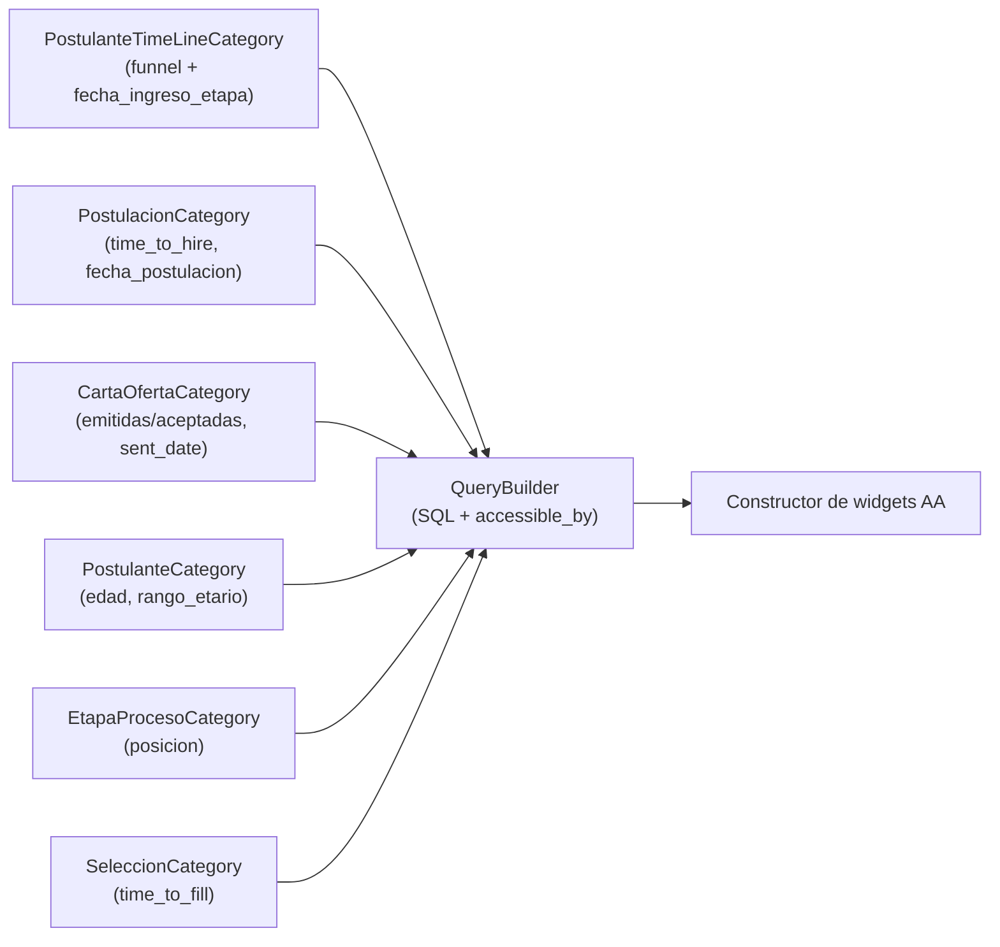

# Misión: Creación de campos nuevos para analytics

**Track:** Adopción Building Block People Analytics en Selección
**Epic:** SEL-6810
**Owner:** Rodrigo Contreras
**Reviewer:** Juan Pablo Saldivar
**Status:** ready
**Dependencias:** 01_migracion-campos-existentes

## Objetivo

Crear los `analytics_field` nuevos que las métricas objetivo del dashboard requieren y que hoy no existen en las categorías de Selección.

## Contexto

Esta misión continúa el trabajo de la misión 01. El contrato es el mismo (Paso 1: `analytics_field` con `sql:`/`value:`; Paso 2: mapeo en `ASSOCIATIONS` y `relations` si el campo proviene de una asociación no declarada todavía). Los reportes ya están registrados en `Analytics::Indicators::Helpers::TemplateRegistry`, así que no se repite el Paso 3 salvo que se agregue un reporte nuevo. El POC (`poc/SEL-6810-migracion-analytics-fields`) ya creó las categorías nuevas `PostulanteTimeLineCategory` (embudo por etapa) y `RecruiterCategory` (reclutadores); el listado de campos de esta misión está cerrado y detallado en `2_jira-cards.md`.

## Criterios de Aceptación No Funcionales

| ID CA-NF | RNF de origen | Criterio de aceptación no funcional |
|----------|--------------|--------------------------------------|
| CA-NF-01 | RNF-02 | Los campos nuevos son aditivos: no alteran los campos migrados en la misión 01 ni el exportador. |
| CA-NF-02 | RNF-03 | Los campos que requieran subqueries correlacionados se identifican y se evalúa su impacto en performance antes de exponerlos. |
| CA-NF-03 | RNF-04 | Cada campo nuevo tiene tests > 80% que cubren contexto analytics y, si aplica, disponibilidad por país. |

## Especificación Técnica

Se aplica el mismo contrato de la misión 01. El SQL, `value:` y rutas de cada campo están en `2_jira-cards.md`. Listado cerrado (incluye los campos de soporte que requieren los widgets de la misión 03):

| Card | Métrica / campo | Campo(s) | Categoría | Estado |
|------|-----------------|----------|-----------|--------|
| 01 | Embudo de candidatos por etapa | `postulante_id`, `qualified_postulante_id` | `PostulanteTimeLineCategory` (nueva) | En el POC; productizar + tests |
| 02 | Time to hire por postulación | `time_to_hire` | `PostulacionCategory` | Nuevo. Entrada a `final_step` menos `postulacions.created_at` (vía `postulante_time_lines`) |
| 03 | Cartas de oferta (emitidas/aceptadas, tasa, por mes) | `oferta_id`, `oferta_status`, `oferta_emitida`, `oferta_aceptada`, `sent_date` | `CartaOfertaCategory` (nueva) | Nuevo. Grano de carta sobre `recruiting_offer_letter_letters` |
| 04 | Edad y rango etario | `edad`, `rango_etario` | `PostulanteCategory` | Nuevo. `AGE(date_of_birth)` + buckets |
| 05 | Dimensiones del funnel temporal | `fecha_ingreso_etapa`, `posicion` | `PostulanteTimeLineCategory`, `EtapaProcesoCategory` | Nuevo. Fecha de ingreso + posición de etapa |
| 06 | Time to fill del proceso | `time_to_fill` | `SeleccionCategory` | Nuevo. `first_hire_date - start_date` |
| 07 | Fecha de postulación (agrupación temporal) | `fecha_postulacion` | `PostulacionCategory` | Nuevo. `postulacions.created_at::date` (tipo fecha) |

`CartaOfertaCategory` es categoría nueva y requiere cableado en `PostulacionReport` (`CATEGORIES`/`ASSOCIATIONS`/`relations`, ver card 03). El resto de categorías ya están cableadas en los reports migrados en la misión 01, por lo que no se modifican `ASSOCIATIONS`/`relations` salvo verificación.

### Diagramas

## Riesgos

| Riesgo | Probabilidad | Impacto | Mitigación |
|--------|-------------|---------|------------|
| Campos nuevos con subqueries correlacionados (embudo, time to hire) degradan widgets sobre colecciones grandes | Media | Medio | Aplicar `LIMIT` en el indicador y evaluar carga asíncrona del widget |
| El embudo (`qualified_postulante_id`) joinea `postulante_time_lines` con `postulantes`/`postulacions` por paths distintos y produce producto cartesiano | Media | Alto | Mantener el filtro embebido en subquery `EXISTS` (patrón del POC), no joins directos |
| `oferta_aceptada` referencia `recruiting_offer_letter_letters` (pack `recruiting/offer_letters`) | Baja | Bajo | Verificar `package_todo.yml` si el `value:` usa el modelo cross-pack |

## Documentación

- [ ] Documentar los campos nuevos y su `sql:`/`value:` en el código de las categorías afectadas

## Fuera de Alcance

- Dashboards o cambios de UI (misión 03).
- Campos ya cubiertos en la misión 01.
- `RecruiterCategory`: ya resuelto en el POC, fuera del alcance de las cards de esta misión.

## Preguntas Abiertas

- Definición de "contratación" para el time to hire: ¿entrada a la etapa final (`final_step`, asumido) o aceptación de carta de oferta?
- Criterio de "oferta aceptada": ¿existe al menos una carta aceptada (asumido) o la última carta (`last_offer_letter`) está aceptada?
