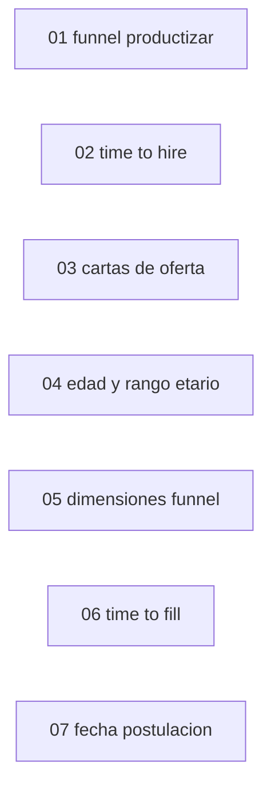

# Cards Jira — Creación de campos nuevos para analytics

**Epic:** SEL-6810
**Tablero:** SEL
**Tamaño del equipo:** 1 dev backend

> **Contexto de implementación:** existe un POC en la rama `poc/SEL-6810-migracion-analytics-fields` (commit `d4136885`) que ya creó dos categorías nuevas: `PostulanteTimeLineCategory` (funnel) y `RecruiterCategory` (reclutadores). La card 01 productiza el funnel; `RecruiterCategory` queda fuera por estar ya resuelta. Las cards 02-08 son campos nuevos que el POC no implementó. Las cards 03 y 05-08 fueron derivadas de los widgets definidos para los dashboards de la misión 03 (ver su `1_mission.md`).
>
> **Lecturas obligatorias antes de implementar cualquier card** (rutas en `buk-webapp`):
> - DSL `analytics_field`: `packs/people_analytics/building_blocks/exportadores/app/services/exportador/custom/categories/analytics_field_definitions.rb`. Firma: `analytics_field(column, origin:, type:, sql: :infer_sql, value:, available_in: [:reports, :analytics], &block)`. Columna real → `sql:` se infiere. Sin SQL viable → `sql: nil` + `available_in: [:reports]`.
> - Contrato del report (cómo agregar categoría nueva: `CATEGORIES`, `ASSOCIATIONS`, `relations`): `1_mission.md` de la misión `01_migracion-campos-existentes`, "Especificación Técnica", Paso 2. Categorías nuevas de referencia ya cableadas: `recruiter_category.rb`, `postulante_time_line_category.rb`.
> - Decisiones y gotchas del POC: `docs/analytics_recruiting_decisions.md` (rama del POC). Clave: `date - date` da `integer` (no usar `EXTRACT(DAY FROM ...)`); subqueries correlacionados; cuidado con joins que producen producto cartesiano.
> - **Regla transversal:** un campo nuevo se declara con `analytics_field`; el `value:`/bloque mantiene el valor en reportes y el `sql:` lo expone en analytics.

## Mapa de Ejecución



> Las cards son independientes (tocan archivos distintos) salvo 02 y 07, que editan `postulacion_category.rb`: coordinarlas si van en paralelo.

---

## 01 — Productizar el funnel de candidatos por etapa (`PostulanteTimeLineCategory`)

**Jira:** [SEL-6963](https://buk.atlassian.net/browse/SEL-6963)
**Tipo:** Task
**Sugerencia de asignación:** 1 dev backend
**Estimación:** 4h

**Resumen:** Revisar, dejar production-ready y cubrir con tests la categoría `PostulanteTimeLineCategory` ya creada en el POC, que alimenta el embudo acumulado de postulantes por etapa.

**Contexto técnico:**
- Archivo: `packs/recruiting/core/app/services/exportador/custom/categories/postulante_time_line_category.rb` (ya existe en el POC).
- Tablas: `postulante_time_lines` (`postulante_id`, `etapa_proceso_id`, `started_at`, `created_at`, `discarded`) joineada vía `etapa_procesos`. Una fila por cada vez que un postulante entró a una etapa.
- Wiring (ya hecho en el POC, verificar) en `seleccion_report.rb`: `CATEGORIES` incluye `PostulanteTimeLineCategory`; `ASSOCIATIONS` tiene `postulante_time_line: { etapa_procesos: :postulante_time_lines }`; `relations` incluye `{ etapa_procesos: :postulante_time_lines }`.
- Campos (ambos `available_in: [:analytics]`):
  - `postulante_id` → `postulante_time_lines.postulante_id` (conteo bruto de pasos por etapa).
  - `qualified_postulante_id` → conteo calificado (postulantes validados con postulación no incompleta en el proceso de la etapa), con SQL embebido `EXISTS` para evitar producto cartesiano. Replica `Recruiting::Statistics::Chart::Generate#data_accumulated_applicants_per_process_stage`.
- Test a crear: `packs/recruiting/core/test/services/exportador/custom/categories/postulante_time_line_category_test.rb` usando `AnalyticsFieldsTestHelper#analytics_field_result` (`packs/people_analytics/building_blocks/custom_report/test/support/analytics_fields_test_helper.rb`).

**Criterios de Aceptación:**
- `qualified_postulante_id` agrupado por etapa (con `count distinct`) reproduce el embudo del statistics actual.
- El subquery no produce duplicados con múltiples postulaciones por postulante.
- Tests cubren ambos campos en contexto analytics, incluyendo un postulante descartado y uno no validado (deben quedar fuera de `qualified_postulante_id`).

---

## 02 — Time to hire por postulación

**Jira:** [SEL-6964](https://buk.atlassian.net/browse/SEL-6964)
**Tipo:** Task
**Sugerencia de asignación:** 1 dev backend
**Estimación:** 6h

**Resumen:** Crear un `analytics_field` que mida los días entre la creación de la postulación y la contratación del candidato (entrada a la etapa final del proceso).

**Contexto técnico:**
- Archivo a editar: `packs/recruiting/core/app/services/exportador/custom/categories/postulacion_category.rb` (origin `:postulacion`, ya cableado en `SeleccionReport` y `PostulacionReport`; no tocar el contrato).
- Definición: `fecha de entrada del candidato a la etapa final (final_step) - postulacions.created_at`, en días. Consistente con `first_hire_date` (SeleccionCategory) y el campo `status` (que marca `'Contratado'` en `final_step`).
- `recruiting_movement_events` **no** tiene `postulante_id`; la fecha de contratación se deriva de `postulante_time_lines` (`postulante_id` + `etapa_proceso_id` + `started_at`):
  ```ruby
  analytics_field :time_to_hire,
                  origin: [:postulacion],
                  type: :number,
                  available_in: [:reports, :analytics],
                  sql: -> {
                    <<~SQL.squish
                      (SELECT (MIN(ptl.started_at)::date - postulacions.created_at::date)
                       FROM postulante_time_lines ptl
                       INNER JOIN etapa_procesos ep ON ep.id = ptl.etapa_proceso_id
                       WHERE ep.seleccion_id = postulacions.seleccion_id
                         AND ep.final_step = true
                         AND ptl.postulante_id = postulacions.postulante_id)
                    SQL
                  },
                  value: -> {
                    final_stage = postulacion&.seleccion&.etapa_procesos&.final_step&.first
                    entry = final_stage&.postulante_time_lines
                                       &.where(postulante_id: postulacion.postulante_id)
                                       &.minimum(:started_at)
                    entry && (entry.to_date - postulacion.created_at.to_date).to_i
                  }
  ```
- Resta directa de fechas; **no** usar `EXTRACT(DAY FROM ...)`. Retorna `nil` si el candidato nunca llegó a la etapa final.
- Test: `packs/recruiting/core/test/services/exportador/custom/categories/postulacion_category_test.rb`.

**Punto a confirmar:** "contratación" por entrada a `final_step` (asumido) vs aceptación de carta de oferta.

**Criterios de Aceptación:**
- Retorna los días entre `postulacions.created_at` y la primera entrada del candidato a la etapa final; `nil` si no contratado.
- Paridad `value:` vs SQL verificada (caso contratado y no contratado).

---

## 03 — Categoría de cartas de oferta (`CartaOfertaCategory`)

**Jira:** [SEL-6965](https://buk.atlassian.net/browse/SEL-6965)
**Tipo:** Task
**Sugerencia de asignación:** 1 dev backend
**Estimación:** 6h

**Resumen:** Crear una categoría nueva a nivel de carta de oferta (una fila por carta) que permita contar emitidas y aceptadas, calcular la tasa de aceptación y agruparla por mes. Reemplaza al simple flag por postulación, porque los widgets necesitan conteos y fecha a nivel de carta.

**Contexto técnico:**
- Archivo a crear: `packs/recruiting/core/app/services/exportador/custom/categories/carta_oferta_category.rb`. Usar `recruiter_category.rb` y `postulante_time_line_category.rb` como plantilla (estructura `new_from_report`, `initialize`, `change_context`, `self.category`, `self.fields`, `self.field_types`).
- Modelo: `Recruiting::OfferLetter::Letter` (`packs/recruiting/offer_letters/app/models/recruiting/offer_letter/letter.rb`). Tabla `recruiting_offer_letter_letters`, columnas `application_id`, `status`, `sent_date`, `reply_date`. Enum `status`: `draft: 0, pending: 1, rejected: 2, accepted: 3, expired: 4`. `Postulacion has_many :offer_letters` (`foreign_key: application_id`) y scope `not_draft` (= emitida).
- Campos (origin `[:carta_oferta]`):
  - `oferta_id` → `recruiting_offer_letter_letters.id` (`type: :number`, `available_in: [:analytics]`) — para `count_distinct`.
  - `oferta_status` → CASE con labels del enum (`type: :string`, `[:reports, :analytics]`).
  - `oferta_emitida` → `CASE WHEN recruiting_offer_letter_letters.status <> 0 THEN 'Si' ELSE 'No' END` (`type: :string`).
  - `oferta_aceptada` → `CASE WHEN recruiting_offer_letter_letters.status = 3 THEN 'Si' ELSE 'No' END` (`type: :string`).
  - `sent_date` → `recruiting_offer_letter_letters.sent_date::date` (`type: :date`, `available_in: [:analytics]`) — para agrupar por mes.
- Wiring en `postulacion_report.rb`: agregar `CartaOfertaCategory` a `CATEGORIES`; `ASSOCIATIONS` con `carta_oferta: :offer_letters`; `relations` con `:offer_letters`. (La explosión por carta es la esperada: una fila por carta de oferta de la postulación.)
- Locales: agregar label de categoría y descripciones en `packs/people_analytics/building_blocks/custom_report/config/locales/models/custom_report_template/es.yml` y `.../services/report/field_information_service/es.yml` (seguir el patrón de `recruiter`/`postulante_time_line`).
- Test a crear: `packs/recruiting/core/test/services/exportador/custom/categories/carta_oferta_category_test.rb`.

**Criterios de Aceptación:**
- `count_distinct(oferta_id)` filtrado por `oferta_emitida = 'Si'` da el total de cartas emitidas; filtrado por `oferta_aceptada = 'Si'` da las aceptadas; el ratio reproduce la tasa de aceptación.
- `sent_date` permite agrupar por mes (tipo fecha, no texto).
- La categoría no rompe los reportes existentes de postulación (la explosión por carta solo aplica cuando se selecciona un campo de esta categoría).
- Tests cubren los campos y un caso sin cartas, con carta `pending` y con carta `accepted`.

---

## 04 — Edad y rango etario de candidatos

**Jira:** [SEL-6966](https://buk.atlassian.net/browse/SEL-6966)
**Tipo:** Task
**Sugerencia de asignación:** 1 dev backend
**Estimación:** 4h

**Resumen:** Crear `analytics_field` `edad` (numérico) y `rango_etario` (string bucketizado) en `PostulanteCategory`, calculados desde `date_of_birth`. Hoy solo existe `date_of_birth` (fecha cruda).

**Contexto técnico:**
- Archivo a editar: `packs/recruiting/core/app/services/exportador/custom/categories/postulante_category.rb` (origin `:postulante`, ya cableado en todos los reports; no tocar el contrato). `date_of_birth` ya está declarado (~línea 48).
- `edad`:
  ```ruby
  analytics_field :edad,
                  origin: [:postulante],
                  type: :number,
                  available_in: [:reports, :analytics],
                  sql: -> { "EXTRACT(YEAR FROM AGE(postulantes.date_of_birth))::int" },
                  value: -> {
                    dob = postulante&.date_of_birth
                    next nil unless dob
                    today = Time.zone.today
                    today.year - dob.year - ((today.month > dob.month || (today.month == dob.month && today.day >= dob.day)) ? 0 : 1)
                  }
  ```
- `rango_etario` (`type: :string`): CASE sobre la edad con tramos (`< 25`, `25-34`, `35-44`, `45-54`, `>= 55`). Definir los tramos exactos con Producto si hay duda.
- Si `Postulante`/`Person` ya exponen un método de edad, reutilizarlo en `value:`.
- Test: `packs/recruiting/core/test/services/exportador/custom/categories/postulante_category_test.rb`.

**Criterios de Aceptación:**
- `edad` retorna los años cumplidos a la fecha actual; `nil` si no hay `date_of_birth`.
- `rango_etario` clasifica cada candidato en su tramo y permite agrupar por tramo en una barra.
- Paridad `value:` vs SQL verificada (incluye un cumpleaños reciente para el ajuste de mes/día).

---

## 05 — Dimensiones para el funnel temporal (fecha de ingreso y posición de etapa)

**Jira:** [SEL-6967](https://buk.atlassian.net/browse/SEL-6967)
**Tipo:** Task
**Sugerencia de asignación:** 1 dev backend
**Estimación:** 3h

**Resumen:** Exponer la fecha de ingreso a la etapa en el funnel y la posición de la etapa, para poder agrupar el funnel por mes y ordenar/identificar la primera etapa.

**Contexto técnico:**
- Archivo 1: `packs/recruiting/core/app/services/exportador/custom/categories/postulante_time_line_category.rb`. Agregar:
  ```ruby
  analytics_field :fecha_ingreso_etapa,
                  origin: [:postulante_time_line],
                  type: :date,
                  available_in: [:analytics],
                  sql: -> { "postulante_time_lines.started_at::date" }
  ```
- Archivo 2: `packs/recruiting/core/app/services/exportador/custom/categories/etapa_proceso_category.rb`. Agregar `posicion` (columna real `etapa_procesos.posicion`, integer):
  ```ruby
  analytics_field :posicion,
                  origin: [:etapa_proceso],
                  type: :number,
                  available_in: [:reports, :analytics],
                  sql: -> { "etapa_procesos.posicion" },
                  value: -> { etapa_proceso&.posicion }
  ```
- La "primera etapa" es la de menor `posicion` del proceso. Las categorías ya están cableadas en `SeleccionReport`; no se toca el contrato.
- Tests: agregar casos en los tests de ambas categorías.

**Criterios de Aceptación:**
- El funnel puede agruparse por mes usando `fecha_ingreso_etapa` (`date_trunc: :month`).
- `posicion` permite ordenar las etapas y filtrar la primera (menor posición).

---

## 06 — Time to fill del proceso (`time_to_fill`)

**Jira:** [SEL-6968](https://buk.atlassian.net/browse/SEL-6968)
**Tipo:** Task
**Sugerencia de asignación:** 1 dev backend
**Estimación:** 3h

**Resumen:** Crear un `analytics_field` `time_to_fill` en `SeleccionCategory`: días entre la apertura del proceso (`start_date`) y la primera contratación (`first_hire_date`).

**Contexto técnico:**
- Archivo a editar: `packs/recruiting/core/app/services/exportador/custom/categories/seleccion_category.rb` (origin `:seleccion`; ya cableado). `first_hire_date` y `start_date` ya existen como `analytics_field` (reutilizar su SQL para el cierre).
  ```ruby
  analytics_field :time_to_fill,
                  origin: [:seleccion],
                  type: :number,
                  available_in: [:reports, :analytics],
                  sql: -> {
                    <<~SQL.squish
                      (SELECT (rme.started_at::date - seleccions.start_date::date)
                       FROM recruiting_movement_events rme
                       INNER JOIN etapa_procesos ep ON ep.id = rme.to_stage_id
                       WHERE ep.seleccion_id = seleccions.id
                         AND ep.final_step = true
                         AND rme.is_discarded = false
                       ORDER BY rme.started_at ASC
                       LIMIT 1)
                    SQL
                  },
                  value: -> {
                    # reutilizar la lógica de first_hire_date
                    final_stage = seleccion.etapa_procesos.final_step.first
                    next nil unless final_stage && seleccion.start_date
                    fhd = final_stage.to_stage_movement_events.where(is_discarded: false).order(started_at: :asc).first&.started_at
                    fhd && (fhd.to_date - seleccion.start_date.to_date).to_i
                  }
  ```
- Resta directa de fechas; sin `EXTRACT(DAY FROM ...)`. Retorna `nil` si el proceso no tiene primera contratación o no tiene `start_date`.
- Test: `packs/recruiting/core/test/services/exportador/custom/categories/seleccion_category_test.rb`.

**Criterios de Aceptación:**
- `time_to_fill` retorna los días entre `start_date` y la primera contratación del proceso; `nil` si no aplica.
- Paridad `value:` vs SQL verificada (proceso con y sin contratación).

---

## 07 — Fecha de postulación para agrupación temporal

**Jira:** [SEL-6969](https://buk.atlassian.net/browse/SEL-6969)
**Tipo:** Task
**Sugerencia de asignación:** 1 dev backend
**Estimación:** 2h

**Resumen:** Exponer la fecha de creación de la postulación como tipo fecha (no texto), para poder agrupar el volumen de postulaciones por semana/mes. El campo actual `created_at_postulacion` es `::text` y no sirve para `date_trunc`.

**Contexto técnico:**
- Archivo a editar: `packs/recruiting/core/app/services/exportador/custom/categories/postulacion_category.rb` (origin `:postulacion`; ya cableado). Agregar un campo distinto al `created_at_postulacion` existente (que apunta a `postulante_time_lines` y es texto):
  ```ruby
  analytics_field :fecha_postulacion,
                  origin: [:postulacion],
                  type: :date,
                  available_in: [:analytics],
                  sql: -> { "postulacions.created_at::date" },
                  value: -> { postulacion&.created_at }
  ```
- Test: `packs/recruiting/core/test/services/exportador/custom/categories/postulacion_category_test.rb`.

**Punto a confirmar:** si conviene cambiar el tipo de `created_at_postulacion` existente en lugar de agregar un campo nuevo. Esta card asume agregar `fecha_postulacion` para no alterar el campo del reporte.

**Criterios de Aceptación:**
- `fecha_postulacion` es de tipo fecha y permite `date_trunc: :week` y `:month`.
- No altera `created_at_postulacion` ni los reportes existentes.
