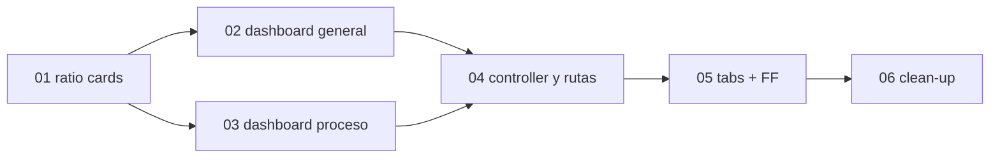

# Cards Jira — Dashboard predeterminado en el módulo de Selección

**Epic:** SEL-6810
**Tablero:** SEL
**Tamaño del equipo:** 1 dev backend + 1 dev frontend

> **Dependencias:** misiones 01 y 02 (todos los campos que consumen los widgets ya deben existir). El set de widgets está cerrado y detallado en `1_mission.md` (sección Widgets).
>
> **Lecturas obligatorias** (rutas en `buk-webapp`):
> - DSL de widgets y dashboard de referencia: `packs/onboarding/core/app/dashboard_resources/onboarding/analytics/procesos_dashboard_resource.rb`.
> - KPI de ratio/porcentaje (referencia): `packs/people_analytics/building_blocks/advanced_analytics/app/lib/analytics/widgets/cards/resources/absenteeism_rate.rb` (`MetricDsl` con dos `indicator` + `formula`, `format :percentage`).
> - Base del dashboard: `packs/plataforma/building_blocks/dashboard/app/lib/dashboards/base_dashboard.rb` y `Dashboards::RenderDashboard`.
> - Spec completo de widgets (template, variables, group_by, filtros por widget): `1_mission.md` de esta misión.

## Mapa de Ejecución

> Las cards 02 y 03 son independientes entre sí pero ambas usan las cards de ratio (01). El controller/rutas (04) espera ambos dashboards. El clean-up (06) va al final, tras validar en ambiente.

---

## 01 — Cards de KPI de ratio (tasa de aceptación de cartas)

**Jira:** [SEL-6970](https://buk.atlassian.net/browse/SEL-6970)
**Tipo:** Task
**Sugerencia de asignación:** 1 dev backend
**Estimación:** 5h

**Resumen:** Crear las cards predefinidas de ratio que usan ambos dashboards: cartas aceptadas sobre emitidas (porcentaje). Se basan en la categoría `CartaOfertaCategory` (misión 02, card 03).

**Contexto técnico:**
- Patrón: `Analytics::Widgets::Cards::Resources::AbsenteeismRate` (`packs/people_analytics/building_blocks/advanced_analytics/app/lib/analytics/widgets/cards/resources/`). Crear una clase análoga con `MetricDsl.build` que declare dos `indicator` sobre `template: :postulacion_report` y una `formula`.
- Indicadores: `aceptadas` = `count_distinct(carta_oferta.oferta_id)` con filtro `oferta_aceptada = 'Si'`; `emitidas` = `count_distinct(carta_oferta.oferta_id)` con filtro `oferta_emitida = 'Si'`. `formula "aceptadas / emitidas * 100"`, `format :percentage`.
- Locales del título/descripción en el pack correspondiente (seguir el patrón de `services.analytics.widgets.cards.resources.*`).

**Criterios de Aceptación:**
- La card retorna el porcentaje de cartas aceptadas sobre emitidas; maneja `emitidas = 0` sin dividir por cero.
- Reutilizable en el dashboard general y en el de proceso (este último filtrado por `seleccion_id`).
- Test de la card con casos: sin cartas, 1 de 2 aceptadas, todas aceptadas.

---

## 02 — Dashboard general (`Recruiting::GeneralStatisticsDashboardResource`)

**Jira:** [SEL-6971](https://buk.atlassian.net/browse/SEL-6971)
**Tipo:** Task
**Sugerencia de asignación:** 1 dev backend
**Estimación:** 10h

**Resumen:** Implementar el dashboard general sobre `Dashboards::BaseDashboard` con los 12 widgets definidos en `1_mission.md` (sección Widgets, tabla "Dashboard general").

**Contexto técnico:**
- Archivo a crear: `packs/recruiting/statistics/app/dashboard_resources/recruiting/general_statistics_dashboard_resource.rb`.
- `include Dashboards::Widgets::Builders::Factory`, `Analytics::Widgets::Builders::Factory`, `Analytics::Filters::Helpers::DateFiltersBuilder`. Hereda de `Dashboards::BaseDashboard`.
- Cada widget según la tabla de `1_mission.md`: tipo (`card`/`chart` con su `Types::*`), `template`, `selected_variables`, `group_by`, `filters`, `transform_keys`. Sin filtro de proceso.
- Los KPI de ratio (#4) usan las cards de la card 01.
- Resolver los confirmables de `1_mission.md` (filtro contratado, colapso de estados en la dona, primera etapa, ratio mes a mes). Preguntar a Producto si hay duda.
- Locales de títulos/descripciones de cada widget.

**Criterios de Aceptación:**
- El dashboard renderiza los 12 widgets con datos correctos sobre `seleccion_report` / `postulacion_report`.
- Los widgets temporales (#5, #10) agrupan por mes; #5 cuenta postulantes que pasaron la primera etapa.
- Respeta `accessible_by` (no muestra datos fuera del alcance del usuario).

---

## 03 — Dashboard por proceso (`Recruiting::ProcessStatisticsDashboardResource`)

**Jira:** [SEL-6972](https://buk.atlassian.net/browse/SEL-6972)
**Tipo:** Task
**Sugerencia de asignación:** 1 dev backend
**Estimación:** 8h

**Resumen:** Implementar el dashboard por proceso sobre `Dashboards::BaseDashboard` con los 7 widgets definidos en `1_mission.md` (tabla "Dashboard por proceso"), todos filtrados por `seleccion_id`.

**Contexto técnico:**
- Archivo a crear: `packs/recruiting/statistics/app/dashboard_resources/recruiting/process_statistics_dashboard_resource.rb`.
- Mismos `include` que la card 02. Todos los indicadores aplican `filters: [{ category: :seleccion, name: :id, filter: { eq: request_params[:seleccion_id] } }]` (el ID llega desde `params` del controller).
- Widget Funnel (#5): `chart Analytics::Widgets::Charts::Types::Funnel`, group_by `etapa_proceso.nombre` ordenado por `etapa_proceso.posicion`.
- Locales de títulos/descripciones.

**Criterios de Aceptación:**
- Los 7 widgets se filtran al proceso indicado por `request_params[:seleccion_id]`.
- El funnel ordena las etapas por `posicion` y usa `qualified_postulante_id`.
- El volumen por semana (#7) agrupa `fecha_postulacion` con `date_trunc: :week`.

---

## 04 — Controller y rutas

**Jira:** [SEL-6973](https://buk.atlassian.net/browse/SEL-6973)
**Tipo:** Task
**Sugerencia de asignación:** 1 dev backend
**Estimación:** 4h

**Resumen:** Reemplazar `Recruiting::StatisticsController` por uno que use `authorize_resource` + `RenderDashboard` y actualizar las rutas (general y por proceso).

**Contexto técnico:**
- Controller: `Recruiting::StatisticsController` con `authorize_resource :recruiting_analytics, class: false` e `include ::Dashboards::RenderDashboard`. Acciones `general_statistics` y `statistics` que hacen `render_dashboard(...)` (ver snippet en `1_mission.md`).
- Rutas: `packs/recruiting/statistics/config/routes/recruiting_statistics.rb` (singular resource para el general; anidada bajo `seleccions` para el de proceso, ver snippet en `1_mission.md`).
- Agregar la entrada en `package_todo.yml` de `packs/recruiting/core` hacia `packs/plataforma/building_blocks/dashboard`.

**Criterios de Aceptación:**
- El controller renderiza ambos dashboards vía `render_dashboard`.
- Las rutas general y por proceso responden correctamente.
- `accessible_by`/permiso `:recruiting_analytics` aplicado.

---

## 05 — Exponer los tabs detrás de feature flag

**Jira:** [SEL-6974](https://buk.atlassian.net/browse/SEL-6974)
**Tipo:** Task
**Sugerencia de asignación:** 1 dev frontend
**Estimación:** 4h

**Resumen:** Agregar los tabs de dashboard en los resources de Selección con guardia de feature flag `sel_feat_advanced_analytics_dashboard` y permiso.

**Contexto técnico:**
- Tab general en el resource del listado de selecciones; tab por proceso en el resource de detalle del proceso (snippets en `1_mission.md`).
- `visible: -> { Buk::Feature.enabled?(:sel_feat_advanced_analytics_dashboard) }`, `can: -> { current_ability.can? :show, :recruiting_analytics }`.
- Los Fiji Resources requieren la skill `fiji-development` antes de editarlos.

**Criterios de Aceptación:**
- Los tabs solo son visibles con el FF activo y `can? :show, :recruiting_analytics`.
- El tab general apunta al dashboard general; el de proceso al dashboard del proceso (`seleccion_id`).

---

## 06 — Clean-up de los dashboards antiguos

**Jira:** [SEL-6975](https://buk.atlassian.net/browse/SEL-6975)
**Tipo:** Task
**Sugerencia de asignación:** 1 dev backend
**Estimación:** 4h

**Resumen:** Eliminar cells, servicios, `GenerateIndicators`, tests y locales del dashboard manual de `packs/recruiting/statistics`.

**Contexto técnico:**
- Eliminar primero `Recruiting::SelectionProcess::GenerateIndicators` en `packs/recruiting/core` (consume `Indicator::Generate`, tiene TODO de remoción).
- Eliminar cells: `ContentGeneralStatisticsCell`, `GeneralStatisticsCell`, `StatisticsCell`, `ChartCell`; servicios: `Chart::Generate`, `Indicator::Generate`, `Helper`; tests y locales asociados.
- Conservar `PostulanteTimeLine.first_movements_to_hired_stage` y demás scopes de modelo que ahora usen los `analytics_field` (verificar antes de borrar).

**Criterios de Aceptación:**
- `grep` confirma que no quedan referencias vivas a las clases eliminadas.
- La suite de tests pasa completa tras la eliminación.
- Los dashboards nuevos cubren la funcionalidad de los antiguos antes de eliminarlos.
