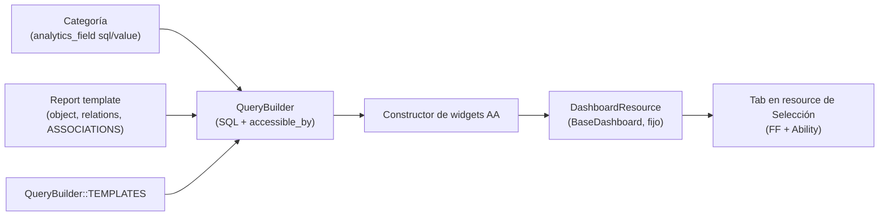
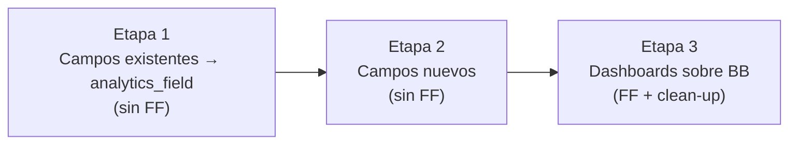
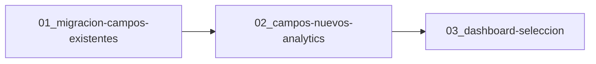

# Track: Adopción Building Block People Analytics en Selección

**Equipo:** Recruiting
**Tablero Jira:** SEL
**Jira Card:**
**Owner:**
**Reviewer:**
**Status:** draft

## Problema

Los reportes personalizados de Selección (proceso, postulación, entrevistas) están implementados como exportadores clásicos: cada categoría define sus campos con métodos Ruby y los datos se obtienen iterando registros en memoria. Ninguna categoría declara `analytics_field`, ningún reporte expone `object`, `relations` ni `ASSOCIATIONS`, y los tres reportes son desconocidos para el `QueryBuilder` de Analítica Avanzada. El building block de dashboards y widgets de People Analytics requiere que los datos sean consultables mediante SQL generado dinámicamente, lo que hoy no es posible para Selección. Además, los dos dashboards del módulo (general y por proceso) están construidos a mano en `packs/recruiting/statistics`, fuera del estándar de la plataforma.

## Requisitos No Funcionales

| ID | Categoría | Requisito no funcional |
|----|-----------|------------------------|
| RNF-01 | Seguridad | Los campos expuestos deben respetar el sistema de permisos existente (Ability). El `QueryBuilder` aplica `accessible_by(@current_ability)` automáticamente sobre el objeto base; el dashboard hereda esos permisos. No se agrega lógica de autorización adicional. |
| RNF-02 | Compatibilidad | La migración a `analytics_field` es aditiva: no debe modificar `fields()` ni `field_types()` ni romper los reportes personalizados existentes. Cero regresiones en exportación. |
| RNF-03 | Performance | Los campos que requieren subqueries correlacionados (conteos, fechas calculadas) pueden degradar el tiempo de respuesta de los widgets sobre colecciones grandes. El `QueryBuilder` aplica `LIMIT` cuando se configura en el indicador. Evaluar carga asíncrona por widget si el tiempo de respuesta lo requiere. |
| RNF-04 | Mantenibilidad | Cobertura de tests > 80% por categoría migrada, incluyendo el contexto analytics y el contexto reporte, y los campos exclusivos por país. |
| RNF-05 | Privacidad de datos | Los campos que exponen RUT usan `CI_PARSERS` que sólo formatean el valor almacenado en BD; no exponen datos adicionales. |

## Notas de Investigación

- El `QueryBuilder` traduce campos de categorías a expresiones SQL, aplica los JOINs declarados y construye un `ActiveRecord::Relation` filtrable, agrupable y agregable sin cargar registros en memoria.
- Para que un reporte sea compatible con el BB, sus categorías deben tener `analytics_field` con expresión `sql:`, sus reports deben declarar `ASSOCIATIONS` y `relations`, y el reporte debe estar registrado en `QueryBuilder::TEMPLATES`.
- El `SeleccionReport` aplica una lógica de generación de filas por clonación de objetos (`clone_with_etapa`, `clone_with_postulacion`) para combinar entidades en una sola fila del Excel; esa lógica es del exportador y no se toca.
- El BB de analytics filtra los campos país-específicos automáticamente en `allowed_analytics_fields` vía `klass.fields(current_ability, country)`. No existen subclases STI por país en las categorías de Recruiting: la tabla `seleccions` es única y los campos país-específicos son columnas opcionales filtradas a nivel de configuración Ruby (`country_specific_field_types`).
- Ciertos campos calculados en Ruby (nombres completos, RUTs humanizados, enums de Brasil con `I18n.t`) producen en SQL una aproximación, no una equivalencia exacta.

## Entidades de Dominio

| Entidad | Definición |
|---------|-----------|
| `analytics_field` | DSL que declara un campo consultable por el `QueryBuilder`. Indica `origin` (tabla que lo provee), `type`, una expresión `sql:` que se inyecta en el SELECT, y el `value:` Ruby equivalente usado en el exportador. |
| `QueryBuilder` | Componente de Analítica Avanzada que traduce categorías a SQL, aplica JOINs y `accessible_by`, y construye el `ActiveRecord::Relation` sobre el que operan widgets y dashboards. |
| `QueryBuilder::TEMPLATES` | Registro `nombre → clase de report`. Sin entrada aquí, el template no aparece en el constructor de widgets. |
| `ASSOCIATIONS` | Constante del report que mapea cada `origin:` de los `analytics_field` a su asociación ActiveRecord. |
| Report template | Clase de reporte (`SeleccionReport` y equivalentes de postulación/entrevistas) que debe responder a `object`, `relations` y `temporality_filter_logic` para ser compatible con el `QueryBuilder`. |
| `Dashboards::BaseDashboard` | Clase base del BB de dashboard. Los dashboards de Selección heredarán de ella e incluirán `Analytics::Widgets::Builders::Factory` para definir sus indicadores sobre los templates migrados. |

## Reglas de Negocio

- Todo campo expuesto en analytics se declara con `analytics_field`; la declaración es aditiva y no altera el comportamiento del exportador.
- El `QueryBuilder` aplica `accessible_by(@current_ability)` sobre el objeto base en todos los casos; los permisos de Ability sobre `Seleccion` y modelos relacionados se respetan automáticamente.
- Las expresiones `sql:` son lambdas Ruby evaluadas en tiempo de carga, no interpolaciones de input de usuario; el query final se compone con Arel.
- Los campos no migrables (muchos a muchos, URLs en runtime) permanecen en el exportador y se documentan explícitamente para no generar expectativas incorrectas.
- El dashboard embebido es fijo y hereda los permisos del `QueryBuilder`.

## Especificación de la Solución

### Descripción

La adopción se ejecuta en tres etapas, repartidas en tres misiones. La **Etapa 1** migra al estándar de Analítica Avanzada los campos que ya existen en las categorías de Selección, mediante tres cambios por report template: (1) declarar `analytics_field` con `origin`, `type`, `sql:` y `value:` en cada categoría; (2) implementar el contrato del `QueryBuilder` en el report (`object`, `relations`, `temporality_filter_logic` y la constante `ASSOCIATIONS`); (3) registrar el template en `QueryBuilder::TEMPLATES`. Es un refactor transparente, sin feature flag. La **Etapa 2** incorpora los `analytics_field` nuevos necesarios para las métricas objetivo, siguiendo el mismo contrato. La **Etapa 3** reemplaza los dashboards manuales por clases que heredan de `Dashboards::BaseDashboard` (`Recruiting::GeneralStatisticsDashboardResource` y `Recruiting::ProcessStatisticsDashboardResource`), expuestas como tabs en los resources de Selección detrás del feature flag `sel_feat_advanced_analytics_dashboard`, y limpia las cells y servicios del antiguo `packs/recruiting/statistics`.

### Diagramas

### Contratos e Integraciones Externas

La solución integra `packs/recruiting/core` con `packs/people_analytics/building_blocks/advanced_analytics` (vía `analytics_field`, `ASSOCIATIONS` y `QueryBuilder::TEMPLATES`) y, en la Etapa 3, con `packs/plataforma/building_blocks/dashboard`. Ambas referencias cruzadas se gestionan con entradas en `package_todo.yml`, sin modificar `package.yml` de los packs involucrados.

### Infraestructura

No requiere cambios de infraestructura. Opera sobre la base de datos PostgreSQL existente (los `analytics_field` generan SQL estándar), el sistema de jobs existente (el `QueryBuilder` es síncrono) y el sistema de caché existente.

## Alternativas de Solución

No existen alternativas reales de implementación. La integración con Analítica Avanzada es una migración al building block existente de la plataforma, no una decisión de diseño abierta: el BB de Advanced Analytics es la única interfaz soportada para construir dashboards analíticos en Buk, con precedentes en otros packs (Onboarding, Documentos, Asset Management, Nómina). Por esto no se levanta un ADR de alternativas a nivel track.

## Riesgos

| Riesgo | Probabilidad | Impacto | Mitigación |
|--------|-------------|---------|------------|
| Divergencia entre el valor Ruby (`value:`) y el resultado SQL en campos calculados (nombres completos, RUTs, enums de Brasil) | Media | Medio | Comparar manualmente `value:` Ruby vs resultado SQL por cada campo calculado antes de desplegar. Documentar diferencias conocidas y aceptadas. |
| Campos de Brasil con traducción `I18n` que requieren `CASE WHEN` con el enum hardcodeado | Baja | Bajo | Generar el `CASE WHEN` a partir del mismo enum `Seleccion::Brasil` y las claves `I18n` del `value:`. Test unitario por campo en un tenant de Brasil. |
| Campos excluidos de analytics presentes en el exportador (`recruiter`, `notes_by_process_stage`, `interviewer_names`) generan expectativa de bug | Baja | Bajo | Documentar en release notes los campos excluidos y su razón. Evaluar proxies disponibles en analytics. |
| Regresión en reportes existentes: los archivos `*_category.rb` y `*_report.rb` son compartidos entre exportador y analytics | Alta | Alto | Cobertura de tests en ambos contextos antes del deploy. Verificar que los reportes personalizados del tenant demo sigan generando correctamente. |

## Instrumentación para Métricas

Pendiente de definir. Se propone conversar con el equipo de People Analytics para añadir marcas de Amplitude sobre el uso de los nuevos dashboards (ver misión `03_dashboard-seleccion`). No hay instrumentación adicional para la migración de campos.

## Mapa de Misiones

Las tres misiones son secuenciales: la 02 reutiliza el contrato establecido en la 01, y la 03 construye los dashboards sobre los campos migrados en la 01 y la 02.

## Estrategia de Desarrollo

**Criterio de slicing:** por etapa de desarrollo / complejidad funcional. La Etapa 1 entrega valor consultable (datos de Selección en AA) de forma independiente y sin riesgo de UI; las etapas siguientes añaden campos y la capa visual.

| Orden | Misión | Valor que entrega | Lanzamiento |
|-------|--------|-------------------|-------------|
| 1 | 01_migracion-campos-existentes | Datos actuales de Selección consultables en el constructor de widgets de AA | Todos (sin FF) |
| 2 | 02_campos-nuevos-analytics | Campos adicionales necesarios para las métricas objetivo | Todos (sin FF) |
| 3 | 03_dashboard-seleccion | Dashboards predefinidos embebidos en el módulo de Selección | Pilotos → Todos (FF) |

**Rollout técnico:**
- **Feature flags:** `sel_feat_advanced_analytics_dashboard` habilita los tabs de dashboard en los resources de Selección (sólo Etapa 3). Las Etapas 1 y 2 no llevan FF.
- **Rollback:** las Etapas 1 y 2 son aditivas y reversibles revirtiendo el código. La Etapa 3 se desactiva apagando el feature flag.
- **Migraciones:** no hay migraciones de esquema; los `analytics_field` generan SQL sobre tablas existentes.
- **Limpieza de deuda:** al cierre de la Etapa 3 se eliminan las cells (`ContentGeneralStatisticsCell`, `GeneralStatisticsCell`, `StatisticsCell`, `ChartCell`), los servicios (`Chart::Generate`, `Indicator::Generate`, `Helper`), `Recruiting::SelectionProcess::GenerateIndicators` en `packs/recruiting/core`, y sus tests y locales asociados. Verificar con `grep` que no queden referencias vivas.

## Fuera de Alcance (nivel track)

- Dashboards editables por el usuario desde la interfaz de Selección.
- Migración de campos no viables (muchos a muchos, URLs en runtime) a analytics.
- Modificación del flujo de exportación personalizado existente.

## Notas de Arquitectura

- **Patrón a seguir:** el contrato de los tres pasos (`analytics_field` → `ASSOCIATIONS`/`relations` → `TEMPLATES`) es la referencia para cada report que se quiera exponer. Otros packs (Onboarding, Documentos, Asset Management, Nómina) ya integran el BB.
- **Permisos:** `accessible_by(@current_ability)` lo aplica el `QueryBuilder`; revisar `core/docs/abilities.md` ante cualquier cambio de permisos.
- **Cross-pack:** las referencias cruzadas se acotan a `TEMPLATES` y `package_todo.yml`; no exponen interfaces públicas entre packs.

## Preguntas Abiertas

- Definir el listado de campos nuevos (Etapa 2) a partir de las métricas objetivo del dashboard.
- Definir los widgets concretos de cada dashboard (Etapa 3).
- Definir si se añade instrumentación de Amplitude y qué eventos.
- Confirmar la aceptación de Producto de la limitación de dashboards fijos.

## Referencias

- Spec del track: `teams/recruiting/tracks/2026/0529_adopcion-bb-analitica-seleccion/spec-track.md`
- Categorías y reports del exportador: `packs/recruiting/core` (exportador `Custom`)
- BB de Analítica Avanzada: `packs/people_analytics/building_blocks/advanced_analytics`
- BB de dashboard: `packs/plataforma/building_blocks/dashboard`
- Dashboards manuales actuales: `packs/recruiting/statistics`
